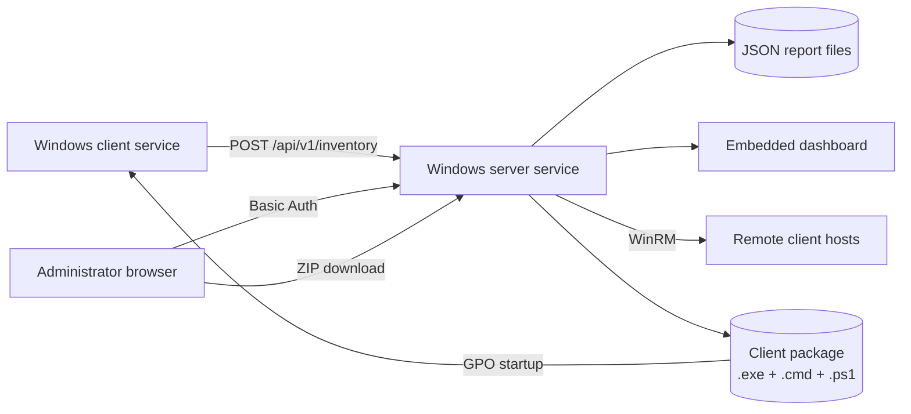

# Windows Inventory Lite

[](https://github.com/didimozg/windows-inventory-lite/releases)
[](https://github.com/didimozg/windows-inventory-lite/actions/workflows/ci.yml)
[](./LICENSE)

## Description

Windows Inventory Lite is a lightweight inventory tool for small Windows networks where a full-scale asset management system would be excessive. It tracks installed software, basic hardware specs, OS version, and Office activation status across workstations and servers.

The client and server are small self-contained C# services that run on .NET Framework 3.5. The server can run on a Windows Server machine or on any regular Windows workstation — no IIS, SQL Server, Python, Node.js, or NuGet packages required. The client can be deployed to computers through WinRM directly from the dashboard, or via a GPO computer startup script.

## Main Features

- Client runs as a Windows Service on Windows 7, 8, 10, and 11.
- Server runs as a Windows Service on Windows Server or desktop Windows.
- Inventory data includes OS version, build, architecture, hardware vendor, model, serial number, IP addresses, Office version, activation facts, and installed software.
- Hardware inventory covers CPU (model, core count, clock speed), RAM (module count, per-module capacity, manufacturer, speed, total capacity), and storage (type HDD/SSD, capacity, model). USB storage devices are flagged separately.
- The dashboard has five views: Clients, Software, Hardware, Client actions, and Client package.
- The Clients view shows per-computer hardware summary (CPU, RAM, storage) in the expandable detail row alongside the software list.
- The Hardware view groups machines by CPU model, storage device, and RAM configuration.
- All dashboard views support column sorting and CSV export with semicolon delimiter for direct opening in Excel.
- The dashboard displays server version and client agent version.
- Operators can delete stale or unwanted host records from the dashboard.
- Operators can install, update, or uninstall clients from the dashboard through WinRM.
- The Client package tab shows the deployed client exe versions and current CMD settings, lets operators reconfigure the server URL, ingestion token, and reporting interval, and provides a ZIP download of the complete GPO package.
- GPO deployment scripts support initial install and later client updates.
- GPO packages include separate .NET 3.5 and .NET 4 client builds to avoid .NET 3.5 prompts on newer Windows versions.
- Optional Basic Auth protects the dashboard and web API.
- Optional ingestion token restricts client report submission.

## Architecture



The client collects data through WMI and registry reads. It writes a local JSON report under `ProgramData` and sends the same JSON to the server. The server stores one JSON file per computer name. The dashboard builds its views from those server-side report files.

The `Client actions` tab sends install, update, or uninstall commands to remote hosts over WinRM using the server-side client package. The `Client package` tab lets operators configure the package and download it as a ZIP for GPO deployment.

## Requirements

Client:

- Windows 7, 8, 10, or 11
- .NET Framework 3.5 or newer
- Built-in Windows PowerShell for installer scripts
- Network access to the server HTTP port

Server:

- Windows Server or desktop Windows
- .NET Framework 3.5 or newer
- Built-in Windows PowerShell for installer scripts
- One TCP port for the standalone HTTP listener

Build host:

- Windows with the local .NET Framework C# compiler
- Windows PowerShell 5.1 or PowerShell 7 for build and install scripts

## Build

Build the server:

```powershell
.\src\Build-Server.ps1
```

Build the default client:

```powershell
.\src\Build-Client.ps1
```

Build a GPO package with both client target frameworks:

```powershell
.\src\New-ClientGpoPackage.ps1 `
    -ServerUrl 'http://inventory.example.local:8080/api/v1/inventory' `
    -OutputPath '.\dist\gpo-client'
```

If the `.cmd` startup wrapper lives in SYSVOL and the PowerShell script plus client executables live in another share, pass the package share path:

```powershell
.\src\New-ClientGpoPackage.ps1 `
    -ServerUrl 'http://inventory.example.local:8080/api/v1/inventory' `
    -OutputPath '.\dist\gpo-client' `
    -PackageSharePath '\\fileserver.example.local\software\windows-inventory-lite'
```

After the server is installed, the server URL, ingestion token, and reporting interval in `Install-ClientGpo.cmd` can be updated from the dashboard `Client package` tab without rebuilding. The tab also generates a ZIP download of the complete package.

## Server Installation

Install the server from an elevated PowerShell session:

```powershell
.\src\Install-Server.ps1 -ListenPrefix 'http://+:8080/' -OpenFirewall
```

Install the server with Basic Auth:

```powershell
.\src\Install-Server.ps1 `
    -ListenPrefix 'http://+:8080/' `
    -OpenFirewall `
    -WebUsername 'inventory-admin' `
    -WebPassword 'replace-with-a-strong-password'
```

The installer writes `C:\ProgramData\WindowsInventoryLite\server-config.json`. Later updates reuse saved `ListenPrefix`, paths, `Token`, `WebUsername`, and `WebPassword` when you do not pass new values.

Dashboard URL:

```text
http://inventory.example.local:8080/
```

## Client Installation

Install one client from an elevated PowerShell session:

```powershell
.\src\Install-Client.ps1 `
    -ServerUrl 'http://inventory.example.local:8080/api/v1/inventory' `
    -IntervalHours 6
```

Run one local collection without installing the service:

```powershell
.\src\Collect-WindowsInventoryLite.ps1 -OutputPath '.\output\localhost.json'
```

Run one collection through the compiled client:

```powershell
.\build\WindowsInventoryLiteClient.exe `
    --once `
    --server-url 'http://inventory.example.local:8080/api/v1/inventory'
```

## GPO Deployment

Use a computer startup script, not a user logon script. The deploy script creates or updates a Windows Service and needs local administrator rights. Computer startup scripts run in the machine context and can manage services.

Deployment flow:

1. Build the package with `New-ClientGpoPackage.ps1`.
2. Copy the package to a computer-readable share.
3. Grant target computer accounts read access to the package files.
4. Grant target computer accounts read access to the package share.
5. Add `Install-ClientGpo.cmd` as a GPO computer startup script.
6. Reboot target computers or wait for the next startup script run.

The deploy script writes a local log to `C:\ProgramData\WindowsInventoryLite\Logs\gpo-deploy.log`.
Central logging to the package share is present in the script as commented code and is disabled by default.

For updates, replace the package files in the share. The deploy script compares the packaged client version with the installed version and skips clients that already match.

## Forced Client Actions Through WinRM

The dashboard `Client actions` tab can install, update, or uninstall the client on a single host, a list of hosts, a single IP address, or a simple IPv4 range such as `192.0.2.10-192.0.2.20`.

Requirements:

- WinRM enabled on target computers.
- The server service account must have administrator rights on target computers.
- The server service account must be allowed to connect through WinRM.
- The server must have a local client package with `Deploy-ClientGpo.ps1`, `WindowsInventoryLiteClient-net35.exe`, and `WindowsInventoryLiteClient-net40.exe`.

When targets are IP addresses, Windows cannot use the default Kerberos path. Use one of these options:

- Use DNS computer names instead of IP addresses.
- Use HTTPS WinRM.
- Enter explicit WinRM credentials in the dashboard and enable `Add to TrustedHosts`.

Build the client package before installing or updating the server:

```powershell
.\src\New-ClientGpoPackage.ps1 `
    -ServerUrl 'http://inventory.example.local:8080/api/v1/inventory' `
    -OutputPath '.\dist\gpo-client'
```

`Install-Server.ps1` copies `.\dist\gpo-client` to `C:\ProgramData\WindowsInventoryLite\client-package` when the folder exists. You can also pass `-ClientPackageSourcePath` and `-ClientPackagePath`.

After installation, the dashboard `Client package` tab can reconfigure the server URL, ingestion token, and reporting interval in `Install-ClientGpo.cmd` without running a new build.

If the server service runs as LocalSystem, WinRM installation to remote computers usually fails. Run the service under a domain account with the required local administrator rights, or use a managed service account with equivalent permissions.
Do not send WinRM passwords through the dashboard over plain HTTP outside a trusted management network.

The server stores WinRM job logs in `DataPath\_client-install-jobs`. The default retention period is 30 days. Set a different default during server installation:

```powershell
.\src\Install-Server.ps1 `
    -ListenPrefix 'http://+:8080/' `
    -InstallLogRetentionDays 60
```

The `Client actions` tab also lets you set the retention period for a specific job. Saved logs contain the action, targets, status, command output, errors, timestamps, and the WinRM username. Passwords are not written to log files.

## Dashboard Usage

The dashboard has five views:

- `Clients`: one row per computer, with OS, Office, activation status, software count, report time, and client agent version. Computers with USB storage devices show a USB badge. Click a computer name to expand the detail row with CPU, RAM, storage summary, and the full software list.
- `Software`: one row per software name, version, and publisher, with the count of installations and the computers where the package appears.
- `Hardware`: three grouped tables. CPUs groups machines by processor model. Storage groups machines by disk model, type, and size. RAM groups by total memory and module count. Click any row to expand the list of machines with that configuration. USB storage rows are highlighted.
- `Client actions`: WinRM actions for installing, updating, or uninstalling the client on a single host, a list of hosts, or an IPv4 range.
- `Client package`: shows deployed client exe versions and the current CMD settings. Lets you update the server URL, ingestion token, and reporting interval, and download the complete GPO package as a ZIP.

Each view has sortable columns. Click a column header to sort ascending; click again to reverse. Click a software or hardware group name to expand the per-computer list.

Each view has an `Export CSV` button. The exported file uses semicolon as the delimiter and a UTF-8 BOM for direct opening in Excel on a Russian or European locale. The export applies the current search filter and the active sort order.

Deleting a host from the dashboard removes the server-side JSON report for that host. If the client service still runs and can reach the server, the host reappears after the next sync.

`Stale >48h` counts reports older than 48 hours or reports with an invalid timestamp.

## Parameters

### Collect-WindowsInventoryLite.ps1

| Parameter | Default | Description |
| --------- | ------- | ----------- |
| `-OutputPath` | `—` | Path for the output JSON report file. |
| `-ServerSharePath` | `—` | UNC path to the server drop share. When provided, the report is also copied there. |
| `-SkipSoftware` | `off` | Skip collecting installed software. |

### Install-Server.ps1

| Parameter | Default | Description |
| --------- | ------- | ----------- |
| `-ListenPrefix` | `http://+:8080/` | HTTP listener prefix for the server service. |
| `-DataPath` | `—` | Folder for received JSON report files. Default: `C:\ProgramData\WindowsInventoryLite\drop`. |
| `-InstallPath` | `—` | Installation folder for the server service. Default: `C:\ProgramData\WindowsInventoryLite`. |
| `-ContentPath` | `—` | Folder for dashboard HTML, CSS, and JavaScript. Default: `InstallPath\dashboard`. |
| `-ClientPackagePath` | `—` | Destination folder for the client package on the server. Default: `InstallPath\client-package`. |
| `-ClientPackageSourcePath` | `—` | Source folder to copy the client package from before installation. |
| `-ConfigPath` | `—` | Server configuration file path. Default: `InstallPath\server-config.json`. |
| `-ServerExecutablePath` | `—` | Path to the prebuilt server executable. Triggers a build if omitted. |
| `-Token` | `—` | Ingestion token required in the `X-Inventory-Token` header. Optional. |
| `-WebUsername` | `—` | Basic Auth username for dashboard and web API access. Optional. |
| `-WebPassword` | `—` | Basic Auth password for dashboard and web API access. Optional. |
| `-InstallLogRetentionDays` | `30` | Default retention period in days for WinRM client action logs. |
| `-OpenFirewall` | `off` | Create a Windows Firewall inbound rule for the listener port. |
| `-NoRun` | `off` | Install and configure the service without starting it. |

### Install-Client.ps1

| Parameter | Default | Description |
| --------- | ------- | ----------- |
| `-ServerUrl` | `—` | HTTP endpoint that receives client JSON reports. Mandatory. |
| `-ServerSharePath` | `—` | UNC path to the server drop share for direct file delivery. Optional. |
| `-Token` | `—` | Ingestion token sent in `X-Inventory-Token`. Optional. |
| `-IntervalHours` | `6` | Collection interval in hours (1–24). |
| `-InstallPath` | `—` | Installation folder for the client service. Default: `C:\ProgramData\WindowsInventoryLite`. |
| `-ClientExecutablePath` | `—` | Path to the prebuilt client executable. Triggers a build if omitted. |
| `-NoRun` | `off` | Install and configure the service without starting it. |

### Install-ClientWinRM.ps1

| Parameter | Default | Description |
| --------- | ------- | ----------- |
| `-ComputerName` | `—` | One or more target computer names or IP addresses. Mandatory. |
| `-ServerUrl` | `—` | HTTP endpoint that receives client JSON reports. Mandatory. |
| `-Token` | `—` | Ingestion token sent in `X-Inventory-Token`. Optional. |
| `-IntervalHours` | `6` | Collection interval in hours (1–24). |
| `-PackagePath` | `—` | Local path to the GPO client package. Default: `dist\gpo-client`. |
| `-RemotePackagePath` | `C:\ProgramData\WindowsInventoryLite\WinRMDeploy` | Temporary folder on the remote host for the package. |
| `-Credential` | `—` | PSCredential for WinRM authentication. Optional. |
| `-CredentialUsername` | `—` | WinRM username as a plain string. Used if `-Credential` is not provided. |
| `-CredentialPassword` | `—` | WinRM password as a plain string. Used if `-Credential` is not provided. |
| `-AddToTrustedHosts` | `off` | Add target computers to WinRM TrustedHosts before connecting. |
| `-Force` | `off` | Reinstall the client even if the version already matches. |
| `-KeepRemotePackage` | `off` | Do not delete the temporary package folder from the remote host after deployment. |

### Uninstall-Client.ps1

| Parameter | Default | Description |
| --------- | ------- | ----------- |
| `-InstallPath` | `C:\ProgramData\WindowsInventoryLite` | Installation folder to remove. |

### Uninstall-ClientWinRM.ps1

| Parameter | Default | Description |
| --------- | ------- | ----------- |
| `-ComputerName` | `—` | One or more target computer names or IP addresses. Mandatory. |
| `-InstallPath` | `C:\ProgramData\WindowsInventoryLite` | Installation folder to remove on remote hosts. |
| `-Credential` | `—` | PSCredential for WinRM authentication. Optional. |
| `-CredentialUsername` | `—` | WinRM username as a plain string. Used if `-Credential` is not provided. |
| `-CredentialPassword` | `—` | WinRM password as a plain string. Used if `-Credential` is not provided. |
| `-AddToTrustedHosts` | `off` | Add target computers to WinRM TrustedHosts before connecting. |

### New-ClientGpoPackage.ps1

| Parameter | Default | Description |
| --------- | ------- | ----------- |
| `-ServerUrl` | `—` | HTTP endpoint to embed in the client startup script. Mandatory. |
| `-Token` | `—` | Ingestion token to embed in the client startup script. Optional. |
| `-IntervalHours` | `6` | Collection interval in hours to embed in the client startup script (1–24). |
| `-OutputPath` | `—` | Output folder for the package. Default: `dist\gpo-client`. |
| `-ClientNet35Path` | `—` | Path to the prebuilt .NET 3.5 client executable. Triggers a build if omitted. |
| `-ClientNet40Path` | `—` | Path to the prebuilt .NET 4 client executable. Triggers a build if omitted. |
| `-PackageSharePath` | `—` | UNC share path embedded in the `.cmd` wrapper when the executables and script live on a share separate from SYSVOL. |

### Build-Server.ps1

| Parameter | Default | Description |
| --------- | ------- | ----------- |
| `-OutputPath` | `—` | Output path for the compiled server executable. Default: `build\WindowsInventoryLiteServer.exe`. |

### Build-Client.ps1

| Parameter | Default | Description |
| --------- | ------- | ----------- |
| `-OutputPath` | `—` | Output path for the compiled client executable. Default: `build\WindowsInventoryLiteClient.exe`. |
| `-TargetFramework` | `Net40` | Target .NET Framework version: `Net35` or `Net40`. |

### Build-InventoryIndex.ps1

| Parameter | Default | Description |
| --------- | ------- | ----------- |
| `-DropPath` | `C:\ProgramData\WindowsInventoryLite\drop` | Folder containing JSON report files from clients. |
| `-DashboardDataPath` | `C:\inetpub\WindowsInventoryLite\data` | Output folder for the generated inventory index. |

### Deploy-ClientGpo.ps1

| Parameter | Default | Description |
| --------- | ------- | ----------- |
| `-ServerUrl` | `—` | HTTP endpoint that receives client JSON reports. Mandatory. |
| `-Token` | `—` | Ingestion token sent in `X-Inventory-Token`. Optional. |
| `-IntervalHours` | `6` | Collection interval in hours (1–24). |
| `-InstallPath` | `—` | Installation folder for the client service. Default: `C:\ProgramData\WindowsInventoryLite`. |
| `-PackageClientPath` | `—` | Path to the client executable in the package. Resolved from the script directory if omitted. |
| `-Force` | `off` | Reinstall the client even if the version already matches. |

## Screenshots

The screenshots below use sample hostnames, documentation IP ranges, and placeholder domains.


## Configuration

- `ServerUrl`: HTTP endpoint that receives client JSON files.
- `IntervalHours`: client collection interval from 1 to 24 hours.
- `ListenPrefix`: server HTTP listener prefix, for example `http://+:8080/`.
- `DataPath`: server folder for received JSON files.
- `ContentPath`: server folder for dashboard HTML, CSS, and JavaScript.
- `ConfigPath`: server configuration file. Default: `C:\ProgramData\WindowsInventoryLite\server-config.json`.
- `InstallLogRetentionDays`: default retention period for WinRM client action logs. Default: `30`.
- `Token`: optional shared token sent in `X-Inventory-Token`.
- `WebUsername` and `WebPassword`: optional Basic Auth credentials for dashboard and web API access.

## Security Notes

- The collector stores activation facts only. It does not export product keys.
- Basic Auth protects browser access, but plain HTTP does not encrypt credentials. Use HTTPS termination or restrict access to trusted management networks.
- Use `-Token`, firewall rules, and network ACLs to limit who can submit inventory reports.
- Do not place a sensitive token in a broadly readable SYSVOL script. For GPO deployments, prefer firewall scope or a low-sensitivity ingestion token.
- If you enable the commented central GPO logging block, limit write access to that log folder to the required computer accounts.
- Review [docs/threat-model.md](./docs/threat-model.md) before exposing the server outside a management network.

## Uninstall

Remove the client service and local client files:

```powershell
.\src\Uninstall-Client.ps1
```

## Project Layout

- `src/`: collector, build scripts, install scripts, and service source code.
- `src/client/`: standalone C# Windows Service client.
- `src/server/`: standalone C# Windows Service server and embedded dashboard.
- `deploy/client/`: GPO startup deployment script and command wrapper.
- `server/dashboard/`: static dashboard files copied by the server installer.
- `docs/`: threat model and operational security notes.
- `examples/`: example install and one-shot commands.
- `tests/`: syntax and language checks.

## License

[MIT License](./LICENSE). Copyright (c) 2026 didimozg.
