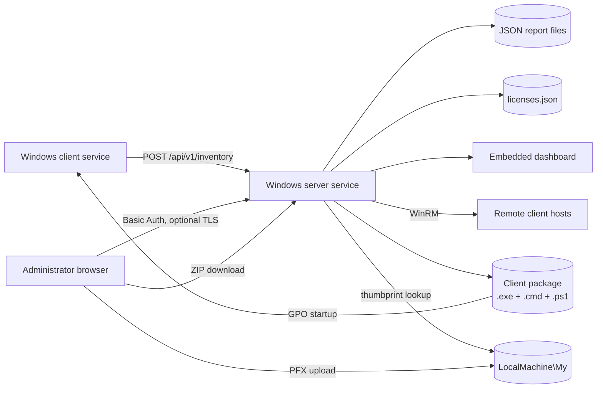
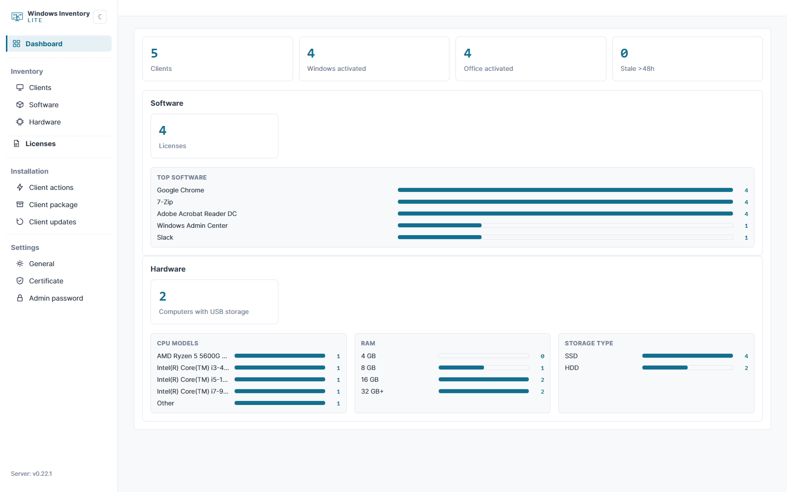
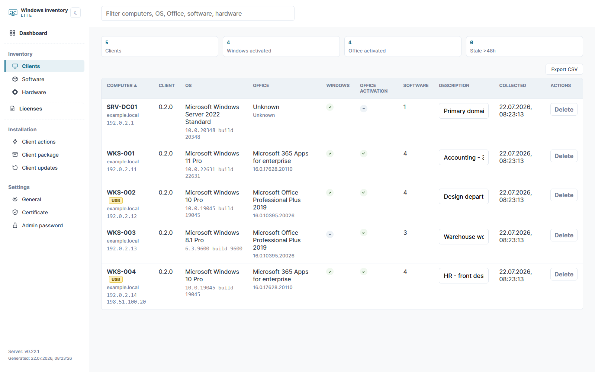
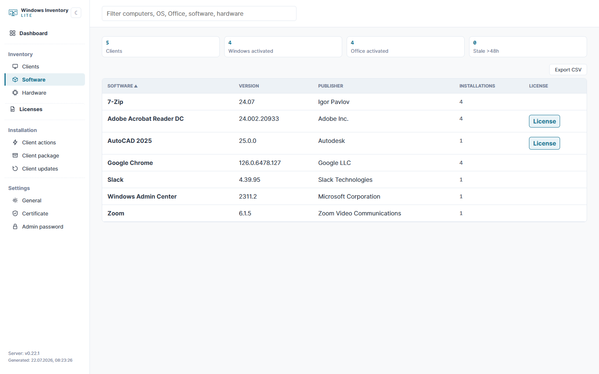
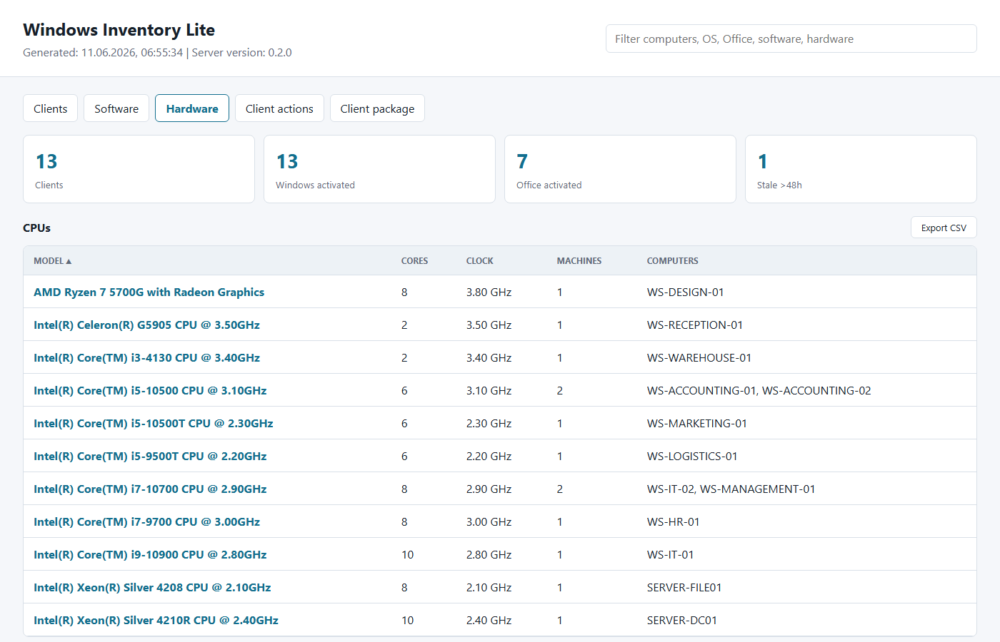
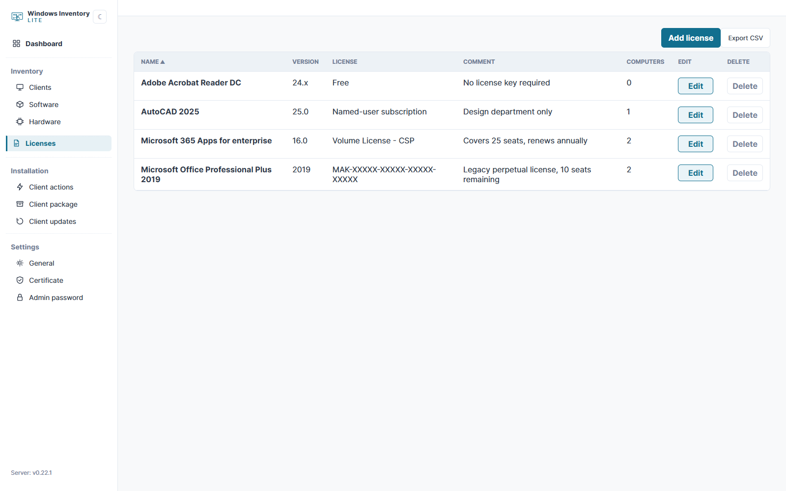
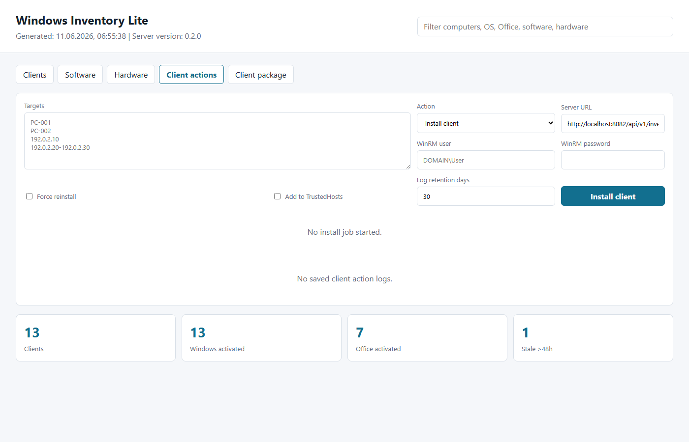
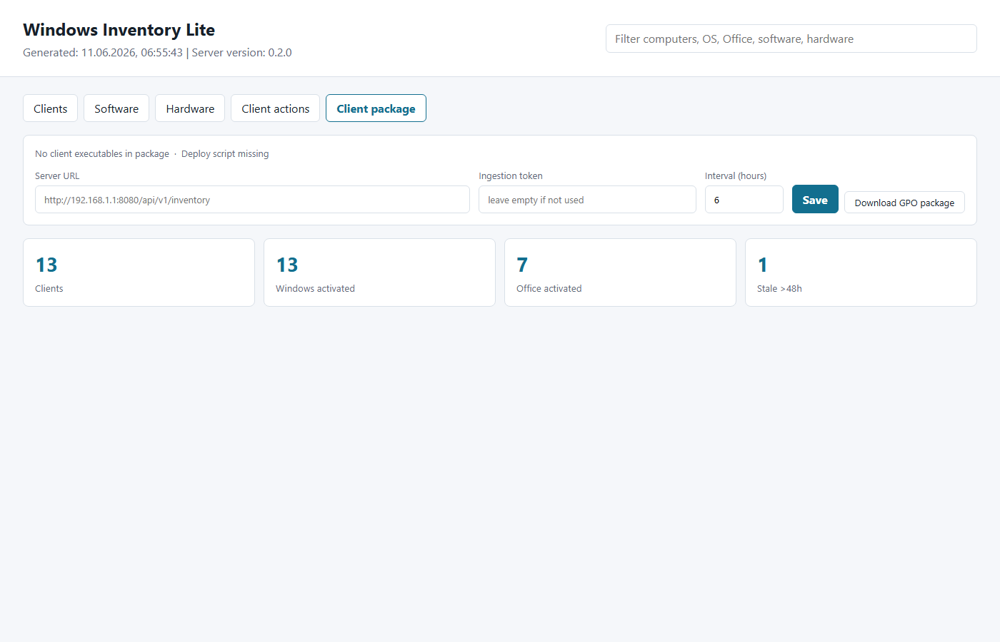

# Windows Inventory Lite


[](https://github.com/didimozg/windows-inventory-lite/releases)
[](https://github.com/didimozg/windows-inventory-lite/actions/workflows/ci.yml)
[](./LICENSE)

## Description

Windows Inventory Lite is a lightweight inventory tool for small Windows networks where a full-scale asset management system would be excessive. It tracks installed software, basic hardware specs, OS version, and Office activation status across workstations and servers.

The client and server are small self-contained C# services that run on .NET Framework 3.5. The server can run on a Windows Server machine or on any regular Windows workstation — no IIS, SQL Server, Python, Node.js, or NuGet packages required. The client can be deployed to computers through WinRM directly from the dashboard, or via a GPO computer startup script.

## Main Features

- Client runs as a Windows Service on Windows 7, 8, 10, and 11.
- Server runs as a Windows Service on Windows Server or desktop Windows.
- Inventory data includes OS version, build, architecture, hardware vendor, model, serial number, IP addresses, Office version, activation facts, and installed software.
- Hardware inventory covers CPU (model, core count, clock speed), RAM (module count, per-module capacity, manufacturer, speed, total capacity), and storage (type HDD/SSD, capacity, model). USB storage devices are flagged separately.
- The dashboard navigation is a tree sidebar, pinned in place while the page content scrolls: Dashboard, Inventory (Clients, Software, Hardware), Licenses, Installation (Client actions, Client package), Settings (General, Certificate, Change admin password). The server version badge sits at the bottom of the sidebar.
- `Dashboard` is the landing page: tile counts for Clients, Windows activated, Office activated, and Stale, a Software card (Licenses count plus a top-5 installed software chart), and a Hardware card (computers with USB storage plus bar-chart breakdowns of CPU models, RAM size, and storage type).
- The Clients view shows per-computer hardware summary (CPU, RAM, storage) in the expandable detail row alongside the software list.
- The Hardware view groups machines by CPU model, storage device, and RAM configuration.
- All dashboard views support column sorting and CSV export with semicolon delimiter for direct opening in Excel.
- The summary count cards (Clients, Windows activated, Office activated, Stale) show only on Clients, Software, and Hardware.
- The dashboard displays server version and client agent version.
- Operators can delete stale or unwanted host records from the dashboard.
- Operators can install, update, or uninstall clients from the dashboard through WinRM.
- The Client package tab shows the deployed client exe versions and current CMD settings, lets operators reconfigure the server URL, ingestion token, and reporting interval, and provides a ZIP download of the complete GPO package.
- HTTPS is a first-class option: bind a certificate at install time by thumbprint or by importing a PFX, or import a new PFX later from the dashboard Certificate tab. Enabling or disabling HTTPS itself is a separate step on the Settings > General page, and every certificate import is checked for common risks (expired, missing private key, no SAN, weak key) and kept in a certificate history log.
- HTTP and HTTPS run as two independent listeners on two independent ports (defaults 8080 and 8443), each start/stop/rebind independently of the other. HTTP can be turned off entirely once HTTPS is confirmed working; the server refuses that change unless HTTPS is genuinely active, so the settings page can never lock itself out.
- The stale threshold (default 48 hours) is configurable on Settings > General instead of fixed in code.
- The Licenses tab tracks a manually entered catalog (name, version, license, comment) separate from the collected software inventory. Name and version can be picked from already-seen installed software or typed freely. Each license can also be linked to specific computers, added manually or auto-filled from installed software. A License button on the Software table opens or creates the matching license record for that software.
- The Settings > Change admin password page rotates the dashboard's Basic Auth password from the browser, and can also perform the initial setup (username and password) without editing `server-config.json` by hand.
- GPO deployment scripts support initial install and later client updates.
- GPO packages include separate .NET 3.5 and .NET 4 client builds to avoid .NET 3.5 prompts on newer Windows versions.
- Optional Basic Auth protects the dashboard and web API.
- Optional ingestion token restricts client report submission.

## Architecture



The client collects data through WMI and registry reads. It writes a local JSON report under `ProgramData` and sends the same JSON to the server. The server stores one JSON file per computer name. The dashboard builds its views from those server-side report files.

The `Client actions` tab sends install, update, or uninstall commands to remote hosts over WinRM using the server-side client package. The `Client package` tab lets operators configure the package and download it as a ZIP for GPO deployment.

The `Certificate` tab manages TLS: it imports an uploaded PFX into the `LocalMachine\My` certificate store and switches the listener to wrap connections in `SslStream`, without a service restart. The `Licenses` tab manages a separate, admin-entered catalog stored as `licenses.json` under the server's data path.

## Requirements

Client:

- Windows 7, 8, 10, or 11
- .NET Framework 3.5 or newer
- Built-in Windows PowerShell for installer scripts
- Network access to the server HTTP port

Server:

- Windows Server or desktop Windows
- .NET Framework 3.5 or newer
- Built-in Windows PowerShell for installer scripts
- One TCP port for the HTTP listener, plus a second TCP port for HTTPS when enabled (defaults: 8080 and 8443)

Build host:

- Windows with the local .NET Framework C# compiler
- Windows PowerShell 5.1 or PowerShell 7 for build and install scripts

## Build

Build the server:

```powershell
.\src\Build-Server.ps1
```

Build the default client:

```powershell
.\src\Build-Client.ps1
```

Build a GPO package with both client target frameworks:

```powershell
.\src\New-ClientGpoPackage.ps1 `
    -ServerUrl 'http://inventory.example.local:8080/api/v1/inventory' `
    -OutputPath '.\dist\gpo-client'
```

If the `.cmd` startup wrapper lives in SYSVOL and the PowerShell script plus client executables live in another share, pass the package share path:

```powershell
.\src\New-ClientGpoPackage.ps1 `
    -ServerUrl 'http://inventory.example.local:8080/api/v1/inventory' `
    -OutputPath '.\dist\gpo-client' `
    -PackageSharePath '\\fileserver.example.local\software\windows-inventory-lite'
```

After the server is installed, the server URL, ingestion token, and reporting interval in `Install-ClientGpo.cmd` can be updated from the dashboard `Client package` tab without rebuilding. The tab also generates a ZIP download of the complete package.

## Server Installation

Install the server from an elevated PowerShell session:

```powershell
.\src\Install-Server.ps1 -ListenPrefix 'http://+:8080/' -OpenFirewall
```

Install the server with Basic Auth:

```powershell
.\src\Install-Server.ps1 `
    -ListenPrefix 'http://+:8080/' `
    -OpenFirewall `
    -WebUsername 'inventory-admin' `
    -WebPassword 'replace-with-a-strong-password'
```

The installer writes `C:\ProgramData\WindowsInventoryLite\server-config.json`. Later updates reuse saved `ListenPrefix`, paths, `Token`, `WebUsername`, and `WebPassword` when you do not pass new values.

Dashboard URL:

```text
http://inventory.example.local:8080/
```

## Client Installation

Install one client from an elevated PowerShell session:

```powershell
.\src\Install-Client.ps1 `
    -ServerUrl 'http://inventory.example.local:8080/api/v1/inventory' `
    -IntervalHours 6
```

Run one local collection without installing the service:

```powershell
.\src\Collect-WindowsInventoryLite.ps1 -OutputPath '.\output\localhost.json'
```

Run one collection through the compiled client:

```powershell
.\build\WindowsInventoryLiteClient.exe `
    --once `
    --server-url 'http://inventory.example.local:8080/api/v1/inventory'
```

## GPO Deployment

Use a computer startup script, not a user logon script. The deploy script creates or updates a Windows Service and needs local administrator rights. Computer startup scripts run in the machine context and can manage services.

Deployment flow:

1. Build the package with `New-ClientGpoPackage.ps1`.
2. Copy the package to a computer-readable share.
3. Grant target computer accounts read access to the package files.
4. Grant target computer accounts read access to the package share.
5. Add `Install-ClientGpo.cmd` as a GPO computer startup script.
6. Reboot target computers or wait for the next startup script run.

The deploy script writes a local log to `C:\ProgramData\WindowsInventoryLite\Logs\gpo-deploy.log`.
Central logging to the package share is present in the script as commented code and is disabled by default.

For updates, replace the package files in the share. The deploy script compares the packaged client version with the installed version and skips clients that already match.

## Forced Client Actions Through WinRM

The dashboard `Client actions` tab can install, update, or uninstall the client on a single host, a list of hosts, a single IP address, or a simple IPv4 range such as `192.0.2.10-192.0.2.20`.

Requirements:

- WinRM enabled on target computers.
- The server service account must have administrator rights on target computers.
- The server service account must be allowed to connect through WinRM.
- The server must have a local client package with `Deploy-ClientGpo.ps1`, `WindowsInventoryLiteClient-net35.exe`, and `WindowsInventoryLiteClient-net40.exe`.

When targets are IP addresses, Windows cannot use the default Kerberos path. Use one of these options:

- Use DNS computer names instead of IP addresses.
- Use HTTPS WinRM.
- Enter explicit WinRM credentials in the dashboard and enable `Add to TrustedHosts`.

Build the client package before installing or updating the server:

```powershell
.\src\New-ClientGpoPackage.ps1 `
    -ServerUrl 'http://inventory.example.local:8080/api/v1/inventory' `
    -OutputPath '.\dist\gpo-client'
```

`Install-Server.ps1` copies `.\dist\gpo-client` to `C:\ProgramData\WindowsInventoryLite\client-package` when the folder exists. You can also pass `-ClientPackageSourcePath` and `-ClientPackagePath`.

After installation, the dashboard `Client package` tab can reconfigure the server URL, ingestion token, and reporting interval in `Install-ClientGpo.cmd` without running a new build.

If the server service runs as LocalSystem, WinRM installation to remote computers usually fails. Run the service under a domain account with the required local administrator rights, or use a managed service account with equivalent permissions.
Do not send WinRM passwords through the dashboard over plain HTTP outside a trusted management network.

The server stores WinRM job logs in `DataPath\_client-install-jobs`. The default retention period is 30 days. Set a different default during server installation:

```powershell
.\src\Install-Server.ps1 `
    -ListenPrefix 'http://+:8080/' `
    -InstallLogRetentionDays 60
```

The `Client actions` tab also lets you set the retention period for a specific job. Saved logs contain the action, targets, status, command output, errors, timestamps, and the WinRM username. Passwords are not written to log files.

## HTTPS Setup

HTTP and HTTPS run as two independent listeners on two independent ports. The default HTTP port is `8080` (set with `-ListenPrefix`) and the default HTTPS port is `8443` (set with `-HttpsPort`). Both can run together, HTTPS-only, or HTTP-only — the server never multiplexes both protocols on a single port.

The server resolves its TLS certificate from the `LocalMachine\My` Windows certificate store by thumbprint. There is no built-in HttpListener/netsh binding — the server wraps each accepted HTTPS connection in `SslStream` directly, so enabling HTTPS, moving its port, or swapping a certificate takes effect without a service restart once the certificate is registered.

Enable HTTPS at install time with a certificate already in the store:

```powershell
.\src\Install-Server.ps1 -CertificateThumbprint 'AABBCCDD...' -UseHttps -HttpsPort 8443
```

Or import a PFX during install:

```powershell
.\src\Install-Server.ps1 `
    -CertificatePfxPath 'C:\certs\inventory.pfx' `
    -CertificatePfxPassword 'replace-with-the-pfx-password'
```

`-UseHttps` is implied automatically when a certificate is supplied and not explicitly disabled with `-UseHttps:$false`. `-HttpsPort` defaults to `8443` and must be different from the HTTP port when both listeners are enabled.

Uploading a certificate and enabling HTTPS are two separate steps. From the dashboard `Certificate` tab, choose a PFX file, enter its password, and upload: the server imports it into `LocalMachine\My` and records it as the configured certificate, but does not touch the HTTPS switch. Turning HTTPS on or off, and changing either port, are Settings > General actions, using whichever certificate is currently configured.

Every uploaded certificate is checked for common problems before it can be used: expired or not-yet-valid, missing private key, no Subject Alternative Name, or an RSA key under 2048 bits. If any of these apply, enabling HTTPS on Settings > General returns the risk list instead of switching over; the operator has to explicitly acknowledge the risks to proceed anyway. Every upload is also kept in a certificate history log, visible on the `Certificate` tab, with the risks found at upload time.

The first PFX upload travels over whatever transport is currently active. If the server is still on plain HTTP, do that first upload from a trusted network or the server console, since the PFX password rides along with the request body in that case.

The `Certificate` tab can also delete the configured certificate from `LocalMachine\My`. If HTTPS was using it, deleting it turns HTTPS off in the same action, since there is nothing left to serve it with.

### Disabling HTTP

Once HTTPS is confirmed working, HTTP can be turned off entirely from Settings > General ("Enable HTTP"), or at install time with `-DisableHttp`:

```powershell
.\src\Install-Server.ps1 -CertificateThumbprint 'AABBCCDD...' -UseHttps -DisableHttp
```

The server refuses to disable HTTP unless HTTPS is genuinely active at that same moment, so the settings page itself can never turn off both listeners and lock the dashboard out. Disabling HTTP, or changing either port, disconnects the current browser session immediately; reload the dashboard at the new address afterward.

### Recovering from an HTTPS lockout

The safety gate above only checks listener state at the moment HTTP is disabled — it cannot see a certificate expiring, being deleted from the store by another tool, or otherwise breaking later. If that happens after HTTP was already turned off, the dashboard becomes unreachable, since there is no listener left to serve it. Recover with either of these, run locally on the server:

1. **Edit the config file and restart the service** (fastest, no reinstall needed). Open `C:\ProgramData\WindowsInventoryLite\server-config.json`, set `"EnableHttp": "true"`, save, then run `Restart-Service WindowsInventoryLiteServer`. HTTP comes back on its last configured port (`ListenPrefix`), and the dashboard is reachable again to fix or replace the certificate.
2. **Re-run the installer without `-DisableHttp`.** `.\src\Install-Server.ps1 -ListenPrefix 'http://+:8080/'` updates the same config value and restarts the service.

Either path only restores HTTP — it does not touch the stored certificate or the `UseHttps` setting, so HTTPS resumes normally on its own once a working certificate is back in place.

## Active Directory Description Sync

Optional and off by default. When enabled, the server looks up each reporting computer's Active Directory `description` attribute and shows it as a column on the `Clients` view - read-only, the dashboard never writes back to AD.

Enable it on Settings > General, in the "Active Directory" block, or at install time:

```powershell
.\src\Install-Server.ps1 -AdSyncEnabled
```

Two sync modes:

- **On inventory report** (default): refreshes a computer's cached AD data when it next reports inventory, if the cached value is older than the configured sync interval (default 24 hours).
- **Periodic timer**: refreshes every known computer on a fixed schedule, independent of whether it has reported recently - useful for computers that still exist in AD but have stopped reporting.

By default the server authenticates to AD using its own Windows Service identity (the same domain account WinRM client actions already require - a `LocalSystem` service can't reach AD any more than it can reach WinRM targets). To use separate, explicit AD credentials instead, uncheck "Use service account identity" and supply a username and password. Unlike `WebPassword`, the AD password is encrypted at rest (Windows DPAPI, machine scope) rather than stored in plaintext.

If a computer's name has no matching AD computer object, the column shows "Not found in AD"; if AD itself was unreachable at sync time, it shows "AD unreachable" and the next report/sweep retries rather than waiting out the full sync interval.

## Diagnostics

Both the server and the client can write an optional debug log - a plain-text file capturing AD lookups, client-server report traffic, and unhandled errors, independent of the Windows Event Log (which needs its event source registered and won't always be reachable, especially right after a fresh install).

Server: toggle "Enable debug log" on Settings > General, or `--debug-log-enabled` / `DebugLogEnabled` in `server-config.json`. Defaults to `<DataPath>\_logs\debug.log`; override with `--debug-log-path`.

Client: `--debug-log-enabled` (service or `--once` runs), defaults to `%ProgramData%\WindowsInventoryLite\_logs\debug-client.log`; override with `--debug-log-path`.

Off by default on both ends. Meant to be switched on for the duration of a troubleshooting session, not left running indefinitely.

## Dashboard Usage

Navigation is a tree sidebar with five sections, pinned in place while the page content scrolls:

```text
Dashboard
Inventory
  Clients
  Software
  Hardware
Licenses
Installation
  Client actions
  Client package
Settings
  General
  Certificate
  Change admin password
```

- `Dashboard`: the landing page (no `#hash` in the URL lands here). Tile counts for Clients, Windows activated, Office activated, and Stale. A Software card shows the Licenses count and a bar chart of the 5 most commonly installed titles (counted by computer, regardless of version). A Hardware card shows computers with USB storage detected, plus bar-chart breakdowns of the top CPU models, RAM size (bucketed at 4/8/16 GB, with everything larger folded into "32 GB+"), and storage type (SSD/HDD only — disks with no recognizable type are left out) across the fleet.
- `Clients`: one row per computer, with OS, Office, activation status, software count, report time, client agent version, and the AD Description column (see [Active Directory Description Sync](#active-directory-description-sync)) when AD sync is enabled. Computers with USB storage devices show a USB badge. Click a computer name to expand the detail row with CPU, RAM, storage summary, and the full software list.
- `Software`: one row per software name, version, and publisher, with the count of installations. Click the name to expand the list of computers where the package appears. A License column links to the matching license record when one already exists for that software name — one license commonly covers several installed versions, so the match is by name only, not name and version.
- `Hardware`: three grouped tables. CPUs groups machines by processor model. Storage groups machines by disk model, type, and size. RAM groups by total memory and module count. Click any row to expand the list of machines with that configuration. USB storage rows are highlighted.
- `Licenses`: a manually maintained catalog with Name, Version, License, Comment, Computers, Edit, and Delete columns. Name and Version can be picked from software already seen in inventory reports or typed freely. Version, License, and Comment stay blank when not set, instead of showing a placeholder. Click the Name to expand the linked computers; add computers by typing a name and pressing Enter, or let it auto-fill by selecting a Name that matches installed software. Edit and Delete are separate, distinctly colored buttons.
- `Client actions`: WinRM actions for installing, updating, or uninstalling the client on a single host, a list of hosts, or an IPv4 range.
- `Client package`: shows deployed client exe versions and the current CMD settings. Lets you update the server URL, ingestion token, and reporting interval, and download the complete GPO package as a ZIP.
- `General`: three blocks. Inventory holds the stale threshold (hours). Network holds the HTTP port and an Enable HTTP switch. HTTPS holds the HTTPS port and an Enable HTTPS switch. Turning HTTPS on re-checks the configured certificate for risks and asks for confirmation if any are found. Changing a port or disabling HTTP disconnects the current browser session; the page warns before applying either change (see [HTTPS Setup](#https-setup)).
- `Certificate`: shows the active certificate (subject, expiry) and its risks if any, lets you upload a PFX to stage it as the configured certificate, delete the installed certificate from the machine store, and shows the certificate history log with a per-entry delete. It does not toggle HTTPS — that's on `General`.
- `Change admin password`: rotates the dashboard's Basic Auth password, or performs the initial setup if none is configured yet (no current password required in that case). Rotating an existing password still requires the current one.

Each view has sortable columns. Click a column header to sort ascending; click again to reverse. Click a software, hardware, or license-computers group name to expand the per-computer list.

Each view has an `Export CSV` button. The exported file uses semicolon as the delimiter and a UTF-8 BOM for direct opening in Excel on a Russian or European locale. The export applies the current search filter and the active sort order.

Deleting a host from the dashboard removes the server-side JSON report for that host. If the client service still runs and can reach the server, the host reappears after the next sync.

`Stale >Nh` counts reports older than the configured stale threshold (default 48 hours, adjustable on `General`) or reports with an invalid timestamp. The summary cards, including this one, show only on Clients, Software, and Hardware.

## Parameters

### Collect-WindowsInventoryLite.ps1

| Parameter | Default | Description |
| --------- | ------- | ----------- |
| `-OutputPath` | `—` | Path for the output JSON report file. |
| `-ServerSharePath` | `—` | UNC path to the server drop share. When provided, the report is also copied there. |
| `-SkipSoftware` | `off` | Skip collecting installed software. |

### Install-Server.ps1

| Parameter | Default | Description |
| --------- | ------- | ----------- |
| `-ListenPrefix` | `http://+:8080/` | HTTP listener prefix for the server service. |
| `-DataPath` | `—` | Folder for received JSON report files. Default: `C:\ProgramData\WindowsInventoryLite\drop`. |
| `-InstallPath` | `—` | Installation folder for the server service. Default: `C:\ProgramData\WindowsInventoryLite`. |
| `-ContentPath` | `—` | Folder for dashboard HTML, CSS, and JavaScript. Default: `InstallPath\dashboard`. |
| `-ClientPackagePath` | `—` | Destination folder for the client package on the server. Default: `InstallPath\client-package`. |
| `-ClientPackageSourcePath` | `—` | Source folder to copy the client package from before installation. |
| `-ConfigPath` | `—` | Server configuration file path. Default: `InstallPath\server-config.json`. |
| `-ServerExecutablePath` | `—` | Path to the prebuilt server executable. Triggers a build if omitted. |
| `-Token` | `—` | Ingestion token required in the `X-Inventory-Token` header. Optional. |
| `-WebUsername` | `—` | Basic Auth username for dashboard and web API access. Optional. |
| `-WebPassword` | `—` | Basic Auth password for dashboard and web API access. Optional. |
| `-CertificateThumbprint` | `—` | Thumbprint of a certificate already in `LocalMachine\My` to use for HTTPS. Optional. |
| `-CertificatePfxPath` | `—` | Path to a `.pfx`/`.p12` file to import into `LocalMachine\My` at install time. Optional. |
| `-CertificatePfxPassword` | `—` | Password for `-CertificatePfxPath`. Required when that parameter is used. |
| `-UseHttps` | `off` | Enable HTTPS. Implied automatically when a certificate is supplied, unless set to `-UseHttps:$false`. |
| `-HttpsPort` | `8443` | HTTPS listener port, independent of `-ListenPrefix`. Must differ from the HTTP port when both are enabled. |
| `-DisableHttp` | `off` | Disable the plain HTTP listener. Requires `-UseHttps` (or an already-configured working HTTPS setup); refused otherwise, since it would make the dashboard unreachable. |
| `-InstallLogRetentionDays` | `30` | Default retention period in days for WinRM client action logs. |
| `-OpenFirewall` | `off` | Create a Windows Firewall inbound rule for the listener port. |
| `-NoRun` | `off` | Install and configure the service without starting it. |
| `-AdSyncEnabled` | `off` | Enable Active Directory Description sync (see [Active Directory Description Sync](#active-directory-description-sync)). |
| `-AdSyncMode` | `on-report` | `on-report` or `timer`. |
| `-AdSyncIntervalHours` | `24` | How often a computer's AD data is refreshed (1–8760). |
| `-AdDomain` | `—` | AD domain to query. Defaults to the server's own domain when omitted. |
| `-AdUsername` | `—` | Explicit AD account to authenticate with, instead of the service identity. |
| `-AdPassword` | `—` | Password for `-AdUsername`. Encrypted at rest (Windows DPAPI) before being written to `server-config.json`. |
| `-DebugLogEnabled` | `off` | Write the optional debug log (see [Diagnostics](#diagnostics)). |
| `-DebugLogPath` | `—` | Debug log file path. Default: `DataPath\_logs\debug.log`. |

### Install-Client.ps1

| Parameter | Default | Description |
| --------- | ------- | ----------- |
| `-ServerUrl` | `—` | HTTP endpoint that receives client JSON reports. Mandatory. |
| `-ServerSharePath` | `—` | UNC path to the server drop share for direct file delivery. Optional. |
| `-Token` | `—` | Ingestion token sent in `X-Inventory-Token`. Optional. |
| `-IntervalHours` | `6` | Collection interval in hours (1–24). |
| `-InstallPath` | `—` | Installation folder for the client service. Default: `C:\ProgramData\WindowsInventoryLite`. |
| `-ClientExecutablePath` | `—` | Path to the prebuilt client executable. Triggers a build if omitted. |
| `-NoRun` | `off` | Install and configure the service without starting it. |

### Install-ClientWinRM.ps1

| Parameter | Default | Description |
| --------- | ------- | ----------- |
| `-ComputerName` | `—` | One or more target computer names or IP addresses. Mandatory. |
| `-ServerUrl` | `—` | HTTP endpoint that receives client JSON reports. Mandatory. |
| `-Token` | `—` | Ingestion token sent in `X-Inventory-Token`. Optional. |
| `-IntervalHours` | `6` | Collection interval in hours (1–24). |
| `-PackagePath` | `—` | Local path to the GPO client package. Default: `dist\gpo-client`. |
| `-RemotePackagePath` | `C:\ProgramData\WindowsInventoryLite\WinRMDeploy` | Temporary folder on the remote host for the package. |
| `-Credential` | `—` | PSCredential for WinRM authentication. Optional. |
| `-CredentialUsername` | `—` | WinRM username as a plain string. Used if `-Credential` is not provided. |
| `-CredentialPassword` | `—` | WinRM password as a plain string. Used if `-Credential` is not provided. |
| `-AddToTrustedHosts` | `off` | Add target computers to WinRM TrustedHosts before connecting. |
| `-Force` | `off` | Reinstall the client even if the version already matches. |
| `-KeepRemotePackage` | `off` | Do not delete the temporary package folder from the remote host after deployment. |

### Uninstall-Client.ps1

| Parameter | Default | Description |
| --------- | ------- | ----------- |
| `-InstallPath` | `C:\ProgramData\WindowsInventoryLite` | Installation folder to remove. |

### Uninstall-ClientWinRM.ps1

| Parameter | Default | Description |
| --------- | ------- | ----------- |
| `-ComputerName` | `—` | One or more target computer names or IP addresses. Mandatory. |
| `-InstallPath` | `C:\ProgramData\WindowsInventoryLite` | Installation folder to remove on remote hosts. |
| `-Credential` | `—` | PSCredential for WinRM authentication. Optional. |
| `-CredentialUsername` | `—` | WinRM username as a plain string. Used if `-Credential` is not provided. |
| `-CredentialPassword` | `—` | WinRM password as a plain string. Used if `-Credential` is not provided. |
| `-AddToTrustedHosts` | `off` | Add target computers to WinRM TrustedHosts before connecting. |

### New-ClientGpoPackage.ps1

| Parameter | Default | Description |
| --------- | ------- | ----------- |
| `-ServerUrl` | `—` | HTTP endpoint to embed in the client startup script. Mandatory. |
| `-Token` | `—` | Ingestion token to embed in the client startup script. Optional. |
| `-IntervalHours` | `6` | Collection interval in hours to embed in the client startup script (1–24). |
| `-OutputPath` | `—` | Output folder for the package. Default: `dist\gpo-client`. |
| `-ClientNet35Path` | `—` | Path to the prebuilt .NET 3.5 client executable. Triggers a build if omitted. |
| `-ClientNet40Path` | `—` | Path to the prebuilt .NET 4 client executable. Triggers a build if omitted. |
| `-PackageSharePath` | `—` | UNC share path embedded in the `.cmd` wrapper when the executables and script live on a share separate from SYSVOL. |

### Build-Server.ps1

| Parameter | Default | Description |
| --------- | ------- | ----------- |
| `-OutputPath` | `—` | Output path for the compiled server executable. Default: `build\WindowsInventoryLiteServer.exe`. |

### Build-Client.ps1

| Parameter | Default | Description |
| --------- | ------- | ----------- |
| `-OutputPath` | `—` | Output path for the compiled client executable. Default: `build\WindowsInventoryLiteClient.exe`. |
| `-TargetFramework` | `Net40` | Target .NET Framework version: `Net35` or `Net40`. |

### Build-InventoryIndex.ps1

| Parameter | Default | Description |
| --------- | ------- | ----------- |
| `-DropPath` | `C:\ProgramData\WindowsInventoryLite\drop` | Folder containing JSON report files from clients. |
| `-DashboardDataPath` | `C:\inetpub\WindowsInventoryLite\data` | Output folder for the generated inventory index. |

### Deploy-ClientGpo.ps1

| Parameter | Default | Description |
| --------- | ------- | ----------- |
| `-ServerUrl` | `—` | HTTP endpoint that receives client JSON reports. Mandatory. |
| `-Token` | `—` | Ingestion token sent in `X-Inventory-Token`. Optional. |
| `-IntervalHours` | `6` | Collection interval in hours (1–24). |
| `-InstallPath` | `—` | Installation folder for the client service. Default: `C:\ProgramData\WindowsInventoryLite`. |
| `-PackageClientPath` | `—` | Path to the client executable in the package. Resolved from the script directory if omitted. |
| `-Force` | `off` | Reinstall the client even if the version already matches. |

## Screenshots

The screenshots below use sample hostnames, documentation IP ranges, and placeholder domains.















## Configuration

- `ServerUrl`: HTTP endpoint that receives client JSON files.
- `IntervalHours`: client collection interval from 1 to 24 hours.
- `ListenPrefix`: server HTTP listener prefix, for example `http://+:8080/`.
- `DataPath`: server folder for received JSON files.
- `ContentPath`: server folder for dashboard HTML, CSS, and JavaScript.
- `ConfigPath`: server configuration file. Default: `C:\ProgramData\WindowsInventoryLite\server-config.json`.
- `InstallLogRetentionDays`: default retention period for WinRM client action logs. Default: `30`.
- `StaleHours`: hours after which a report counts as stale. Default: `48`. Adjustable on the dashboard Settings > General page.
- `Token`: optional shared token sent in `X-Inventory-Token`.
- `WebUsername` and `WebPassword`: optional Basic Auth credentials for dashboard and web API access.
- `UseHttps` and `CertificateThumbprint`: optional HTTPS settings. The certificate itself lives in `LocalMachine\My`, not in this file.
- `HttpsPort`: HTTPS listener port, independent of `ListenPrefix`. Default: `8443`.
- `EnableHttp`: whether the plain HTTP listener runs at all. Default: `true`.

## Security Notes

- The collector stores activation facts only. It does not export product keys.
- Basic Auth protects browser access. Plain HTTP does not encrypt credentials in transit — enable HTTPS (see [HTTPS Setup](#https-setup)) or restrict access to trusted management networks.
- The first PFX upload travels over whatever transport is active at that moment. Do it from a trusted network or the server console if the server is still plain HTTP.
- A certificate with known risks (expired, no private key, no SAN, weak key) can still be enabled on Settings > General, but only after the operator explicitly acknowledges the specific risks shown — it is not a silent action.
- Use `-Token`, firewall rules, and network ACLs to limit who can submit inventory reports.
- Do not place a sensitive token in a broadly readable SYSVOL script. For GPO deployments, prefer firewall scope or a low-sensitivity ingestion token.
- If you enable the commented central GPO logging block, limit write access to that log folder to the required computer accounts.
- License records are free-text, admin-entered fields (Name, Version, License, Comment). Do not put secrets or credentials in the License or Comment fields; they are stored in plain JSON and rendered as-is in the dashboard.
- Setting the initial Basic Auth username and password from the dashboard requires no prior authentication, since the whole dashboard is already open while Basic Auth is unconfigured. Once a password is set, changing it always requires the current one. Set up Basic Auth (or restrict network access) before exposing the server beyond a trusted network.
- Disabling HTTP requires HTTPS to be genuinely active at that same moment; the server rejects the change otherwise, so the settings page can never produce a fully unreachable configuration by itself. A certificate that stops working later (expiry, deletion from the store) can still leave the dashboard unreachable after HTTP was disabled — see [Recovering from an HTTPS lockout](#recovering-from-an-https-lockout).
- Review [docs/threat-model.md](./docs/threat-model.md) before exposing the server outside a management network.
- The AD password (explicit-credentials mode) is encrypted at rest with Windows DPAPI; `WebPassword`/`Token`/the certificate PFX password remain plaintext in `server-config.json`, protected only by the file's restricted ACL.
- The debug log (see [Diagnostics](#diagnostics)) can contain client-reported computer names and full exception text (including stack traces) but never passwords or tokens. Treat it like any other operational log - avoid leaving it enabled longer than a troubleshooting session needs.

## Uninstall

Remove the client service and local client files:

```powershell
.\src\Uninstall-Client.ps1
```

## Project Layout

- `src/`: collector, build scripts, install scripts, and service source code.
- `src/client/`: standalone C# Windows Service client.
- `src/server/`: standalone C# Windows Service server and embedded dashboard.
- `deploy/client/`: GPO startup deployment script and command wrapper.
- `server/dashboard/`: static dashboard files copied by the server installer.
- `docs/`: threat model and operational security notes.
- `examples/`: example install and one-shot commands.
- `tests/`: syntax and language checks.

## License

[MIT License](./LICENSE). Copyright (c) 2026 didimozg.
