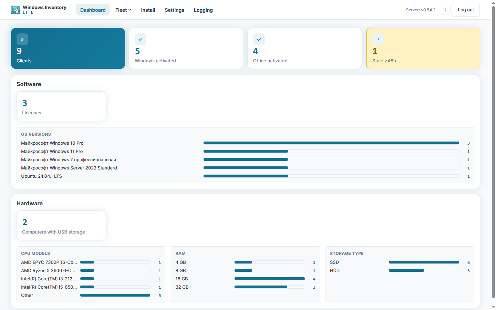
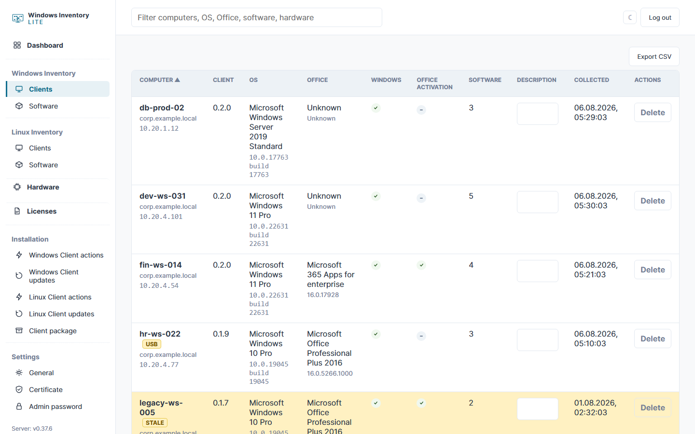
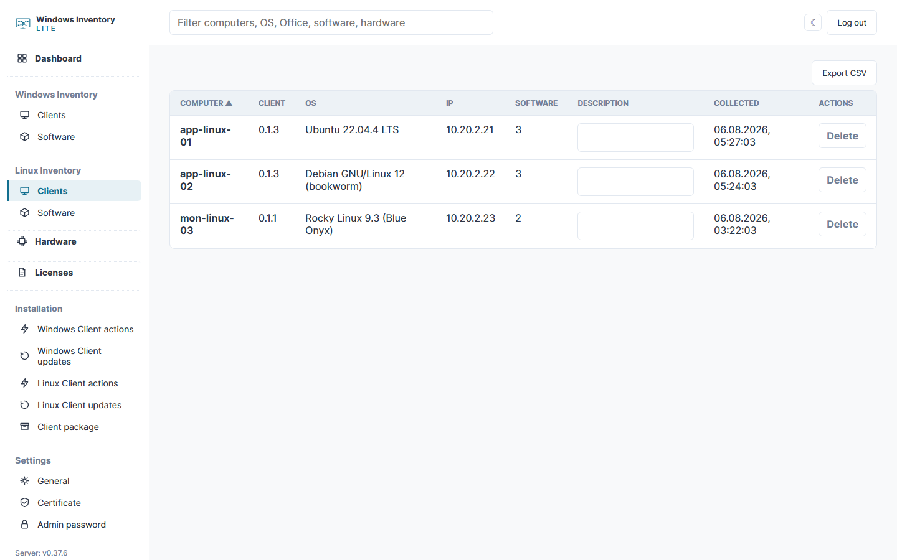
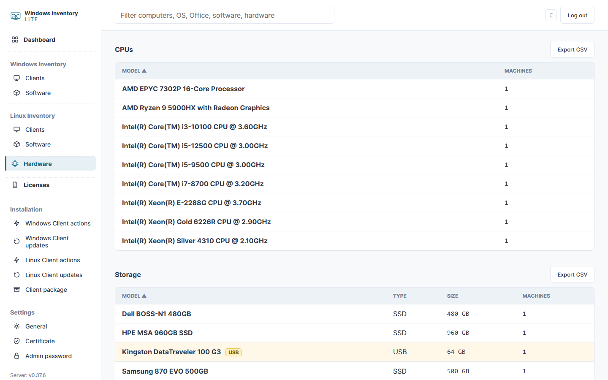
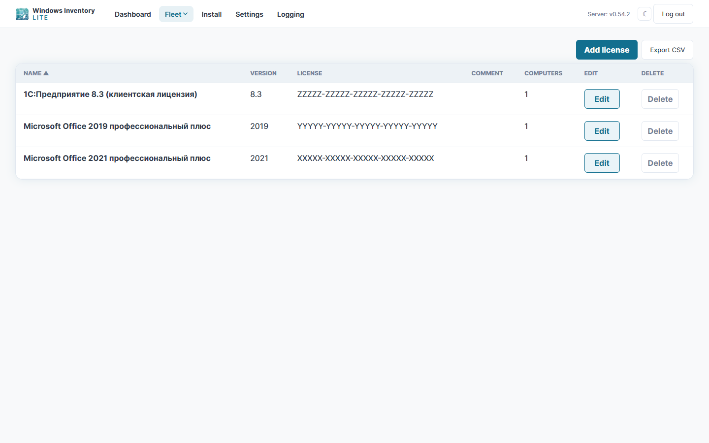

# Windows Inventory Lite

> This project was built to the author's own personal requirements. Idea and direction: the author. Implementation: Claude (Anthropic).


[](https://github.com/didimozg/windows-inventory-lite/releases)
[](https://github.com/didimozg/windows-inventory-lite/actions/workflows/ci.yml)
[](./LICENSE)

## Description

Windows Inventory Lite is a lightweight inventory tool for small Windows and Linux networks where a full-scale asset management system would be excessive. It tracks installed software, hardware specs, OS version, and Office activation status across Windows workstations, Windows servers, and Debian-family Linux hosts, through a single web dashboard.

The Windows client and server are small self-contained C# services on .NET Framework 3.5 - no IIS, SQL Server, Python, Node.js, or NuGet packages required. The Linux client is a single static Go binary reporting over HTTPS. Windows clients deploy through WinRM directly from the dashboard or via a GPO computer startup script; Linux clients deploy over SSH from the same dashboard.

## What it does

- Collects OS version, hardware (CPU, RAM, storage, USB detection), installed software, and Windows/Office activation status from every reporting machine, Windows or Linux.
- One dashboard shows both fleets side by side: separate Clients/Software tables per platform, plus a combined Hardware view and combined summary tiles across both.
- Installs, updates, or uninstalls the Windows client over WinRM, or the Linux client over SSH (key or password), straight from the dashboard - no need to touch each machine by hand.
- Optional GPO deployment for Windows fleets that prefer a computer startup script over a WinRM push.
- A manually maintained software license catalog, linked to the computers that use each license.
- Optional HTTPS (self-managed certificate store, no reverse proxy required), Basic Auth, Active Directory description sync and computer import, and an ingestion token to restrict who can submit reports.

See [the parameters reference](./docs/parameters-reference.md) for every script parameter and configuration key, and the [threat model](./docs/threat-model.md) for what's authenticated, what's encrypted at rest, and what to check before exposing the server beyond a trusted network.

## Requirements

**Windows client:** Windows 7/8/10/11, .NET Framework 3.5+, built-in PowerShell.
**Windows server:** Windows Server or desktop Windows, .NET Framework 3.5+, one TCP port for HTTP and optionally a second for HTTPS (defaults 8080/8443).
**Linux client:** Debian or Ubuntu, amd64.
**Build host:** Windows with the .NET Framework C# compiler and PowerShell 5.1+; a Go toolchain only if rebuilding the Linux client from source (a prebuilt binary ships in the repo otherwise).

## Quick start

Build and install the server:

```powershell
.\src\Build-Server.ps1
.\src\Install-Server.ps1 -ListenPrefix 'http://+:8080/' -OpenFirewall
```

Open the dashboard at `http://<server>:8080/`, then either run the interactive wizard for a menu-driven walkthrough of every install/uninstall flow:

```powershell
.\src\Install-Wizard.ps1
```

or install one Windows client directly:

```powershell
.\src\Install-Client.ps1 -ServerUrl 'http://<server>:8080/api/v1/inventory' -IntervalHours 6
```

or push a Linux client over SSH:

```powershell
.\src\Install-ClientDebianSSH.ps1 -ComputerName 192.0.2.10 -ServerUrl 'https://<server>/api/v1/linux/inventory' -CredentialUsername root -KeyPath C:\path\to\id_ed25519
```

Full parameters for every script, every `server-config.json` key, GPO deployment, and remote WinRM pushes are in [docs/parameters-reference.md](./docs/parameters-reference.md).

## Using the dashboard

The sidebar is a tree with five sections: **Dashboard** (the landing page - summary tiles and top-software/hardware charts across both fleets), **Windows Inventory** and **Linux Inventory** (each with Clients and Software tables), a single **Hardware** view merging both platforms into one, **Licenses**, **Installation** (Client actions/updates for Windows, the same pair for Linux, and package configuration for both), and **Settings** (general options, HTTPS certificate management, admin password).

The dashboard polls every 30 seconds and updates in place - sort order, search, and expanded rows are preserved. Every table supports column sorting, a search filter, and CSV export (semicolon-delimited, UTF-8 BOM, for direct opening in Excel). Click a computer, software title, or hardware group to expand its detail row.

## Screenshots

Captured from a scratch instance seeded with fictional test data - no real hosts, credentials, or license keys.











## Documentation

- [Parameters and configuration reference](./docs/parameters-reference.md) - every script parameter, `server-config.json` key, and uninstall command.
- [HTTP API reference](./docs/api-reference.md) - every endpoint the server exposes.
- [Threat model](./docs/threat-model.md) - assets, trust boundaries, required invariants, known risks, controls, and operational security notes.
- [CHANGELOG.md](./CHANGELOG.md) - full version history.

## License

[MIT License](./LICENSE). Copyright (c) 2026 didimozg.

## Credits

Implemented by [Claude Code](https://claude.com/claude-code) (Anthropic), using these third-party agent/skill packs during development:

- [obra/superpowers](https://github.com/obra/superpowers) - brainstorming, planning, subagent-driven development, systematic debugging, and code review workflow.
- [affaan-m/ECC](https://github.com/affaan-m/ECC) - API design, frontend design, and verification-loop patterns.
- [anthropics/skills](https://github.com/anthropics/skills) - browser-based web app testing.
