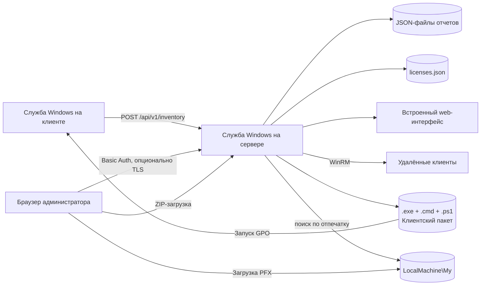

# Windows Inventory Lite


[](https://github.com/didimozg/windows-inventory-lite/releases)
[](https://github.com/didimozg/windows-inventory-lite/actions/workflows/ci.yml)
[](./LICENSE)

## Описание

Windows Inventory Lite — легкий инструмент инвентаризации для небольших сетей Windows, где полноценная система управления активами избыточна. Собирает данные об установленном ПО, базовых аппаратных характеристиках, версии ОС и состоянии активации Office на рабочих станциях и серверах.

Клиент и сервер — небольшие самодостаточные службы на C# с целевой платформой .NET Framework 3.5. Сервер может работать как на Windows Server, так и на обычном компьютере с настольной Windows — IIS, SQL Server, Python, Node.js и NuGet-пакеты не нужны. Клиент разворачивается на компьютеры через WinRM прямо из web-интерфейса или через сценарий запуска компьютера в GPO.

## Возможности

- Клиент работает как служба Windows на Windows 7, 8, 10 и 11.
- Сервер работает как служба Windows на Windows Server или настольной Windows.
- Отчет содержит версию ОС, номер сборки, архитектуру, производителя, модель, серийный номер, IP-адреса, версию Office, факты активации и список установленного ПО.
- Аппаратная инвентаризация включает: процессор (модель, количество ядер, тактовая частота), ОЗУ (количество модулей, объем и производитель каждого, суммарный объем), накопители (тип HDD/SSD, объем, модель). USB-накопители выделяются отдельно.
- Навигация web-интерфейса — древовидная боковая панель, зафиксированная на месте при прокрутке содержимого: Dashboard, Inventory (Clients, Software, Hardware), Licenses, Installation (Client actions, Client package), Settings (General, Certificate, Change admin password). Плашка с версией сервера — внизу боковой панели.
- `Dashboard` — стартовая страница: плитки со счётчиками Clients, Windows activated, Office activated и Stale, карточка Software (число лицензий и график топ-5 установленного ПО) и карточка Hardware (число компьютеров с USB-накопителем и мини-графики по моделям CPU, объёму ОЗУ и типу накопителей).
- Вкладка Clients показывает для каждого компьютера сводку по оборудованию (CPU, ОЗУ, накопители) и список ПО в развернутой строке детализации.
- Вкладка Hardware группирует компьютеры по модели процессора, накопителю и конфигурации ОЗУ.
- Все вкладки поддерживают сортировку по столбцам и экспорт в CSV с разделителем «;» для прямого открытия в Excel.
- Карточки-счётчики (Clients, Windows activated, Office activated, Stale) показываются только на вкладках Clients, Software и Hardware.
- Web-интерфейс показывает версию сервера и версию клиентского агента.
- Хосты можно удалять из web-интерфейса, если запись больше не нужна.
- Из web-интерфейса можно устанавливать, обновлять и удалять клиенты через WinRM.
- Вкладка Client package показывает версии клиентских исполняемых файлов и текущие настройки CMD-файла, позволяет обновить адрес сервера, токен приема и интервал отчетности, а также скачать готовый GPO-пакет в виде ZIP-архива.
- HTTPS — полноценная встроенная возможность: сертификат можно привязать по отпечатку или PFX-файлу при установке, либо импортировать новый PFX позже прямо из вкладки Certificate. Включение и отключение HTTPS — отдельный шаг на странице Settings > General; каждый импортированный сертификат проверяется на типовые риски (истёк срок, нет приватного ключа, нет SAN, слабый ключ), и все загрузки сохраняются в истории сертификатов.
- HTTP и HTTPS — два независимых слушателя на двух независимых портах (по умолчанию 8080 и 8443), каждый запускается, останавливается и переключает порт независимо от другого. HTTP можно полностью отключить, как только HTTPS подтверждённо работает; сервер отклоняет такое изменение, если HTTPS в этот момент реально не активен, поэтому со страницы настроек невозможно самому себе перекрыть доступ.
- Порог «устаревания» отчета (по умолчанию 48 часов) теперь настраивается на странице Settings > General, а не зашит в коде.
- Вкладка Licenses ведёт отдельный, вручную заполняемый каталог (название, версия, лицензия, комментарий), не связанный с автоматически собранным ПО. Название и версию можно выбрать из уже встречавшегося установленного ПО или ввести вручную. К каждой лицензии можно привязать список компьютеров — вручную или автоматически по выбранному ПО. Кнопка License в таблице Software открывает или создаёт соответствующую запись лицензии для этого ПО.
- Страница Settings > Change admin password меняет пароль Basic Auth прямо из браузера, а также может выполнить первоначальную настройку (имя пользователя и пароль) без ручного редактирования server-config.json.
- Скрипты развертывания через GPO поддерживают первичную установку и обновление клиента.
- GPO-пакет содержит отдельные сборки клиента под .NET 3.5 и .NET 4, чтобы Windows 8/10/11 не запрашивали установку .NET 3.5.
- Basic Auth может защищать web-интерфейс и web API.
- Токен приема отчетов может ограничивать отправку клиентских отчетов.

## Архитектура



Клиент собирает данные через WMI и чтение реестра. Он пишет локальный JSON в `ProgramData` и отправляет тот же JSON на сервер. Сервер хранит по одному JSON-файлу на компьютер. Web-интерфейс строит все вкладки по этим серверным JSON-файлам.

Вкладка `Client actions` отправляет команды установки, обновления или удаления клиента на удалённые хосты по WinRM. Вкладка `Client package` позволяет настроить пакет и скачать его в виде ZIP для развёртывания через GPO.

Вкладка `Certificate` управляет TLS: импортирует загруженный PFX в хранилище сертификатов `LocalMachine\My` и переключает слушатель на обёртку `SslStream` без перезапуска службы. Вкладка `Licenses` управляет отдельным, вручную заполняемым каталогом, который хранится в `licenses.json` в папке данных сервера.

## Требования

Клиент:

- Windows 7, 8, 10 или 11
- .NET Framework 3.5 или новее
- Встроенный Windows PowerShell для скриптов установки
- Сетевой доступ к HTTP-порту сервера

Сервер:

- Windows Server или настольная Windows
- .NET Framework 3.5 или новее
- Встроенный Windows PowerShell для скриптов установки
- Один TCP-порт для HTTP-слушателя, плюс отдельный TCP-порт для HTTPS, если он включён (по умолчанию 8080 и 8443)

Хост для сборки:

- Windows с локальным компилятором C# из .NET Framework
- Windows PowerShell 5.1 или PowerShell 7 для сборки и установки

## Сборка

Сборка сервера:

```powershell
.\src\Build-Server.ps1
```

Сборка клиента по умолчанию:

```powershell
.\src\Build-Client.ps1
```

Сборка GPO-пакета с двумя целевыми версиями .NET Framework для клиента:

```powershell
.\src\New-ClientGpoPackage.ps1 `
    -ServerUrl 'http://inventory.example.local:8080/api/v1/inventory' `
    -OutputPath '.\dist\gpo-client'
```

Если `.cmd`-обертка лежит в SYSVOL, а PowerShell-скрипт и клиентские `.exe` лежат в другой сетевой папке, укажите путь к этой папке:

```powershell
.\src\New-ClientGpoPackage.ps1 `
    -ServerUrl 'http://inventory.example.local:8080/api/v1/inventory' `
    -OutputPath '.\dist\gpo-client' `
    -PackageSharePath '\\fileserver.example.local\software\windows-inventory-lite'
```

После установки сервера адрес сервера, токен и интервал отчетности в `Install-ClientGpo.cmd` можно изменить через вкладку `Client package` в web-интерфейсе без повторной сборки. Там же можно скачать готовый ZIP-пакет.

## Интерактивный мастер установки

Для первого знакомства с проектом запустите `src/Install-Wizard.ps1` без параметров — это меню с пошаговыми вопросами для установки или удаления сервера, локального клиента или клиентов на удаленных машинах через WinRM. Мастер задает вопросы по одному и перед запуском показывает точную команду, которую собирается выполнить. Остальные сценарии ниже, основанные на флагах, никуда не делись — мастер их просто вызывает, а не заменяет.

Используйте `-WhatIf`, чтобы пройти все вопросы и увидеть итоговую команду без реального запуска.

## Установка сервера

Запустите установку сервера из PowerShell с правами администратора:

```powershell
.\src\Install-Server.ps1 -ListenPrefix 'http://+:8080/' -OpenFirewall
```

Установка сервера с Basic Auth:

```powershell
.\src\Install-Server.ps1 `
    -ListenPrefix 'http://+:8080/' `
    -OpenFirewall `
    -WebUsername 'inventory-admin' `
    -WebPassword 'replace-with-a-strong-password'
```

Установщик пишет настройки в `C:\ProgramData\WindowsInventoryLite\server-config.json`. При следующих обновлениях он переиспользует сохраненные `ListenPrefix`, пути, `Token`, `WebUsername` и `WebPassword`, если вы не передали новые значения.

Адрес web-интерфейса:

```text
http://inventory.example.local:8080/
```

## Установка клиента

Установка одного клиента из PowerShell с правами администратора:

```powershell
.\src\Install-Client.ps1 `
    -ServerUrl 'http://inventory.example.local:8080/api/v1/inventory' `
    -IntervalHours 6
```

Разовый локальный сбор без установки службы:

```powershell
.\src\Collect-WindowsInventoryLite.ps1 -OutputPath '.\output\localhost.json'
```

Разовый сбор через собранный клиент:

```powershell
.\build\WindowsInventoryLiteClient.exe `
    --once `
    --server-url 'http://inventory.example.local:8080/api/v1/inventory'
```

## Развертывание через GPO

Используйте сценарий запуска компьютера, а не сценарий входа пользователя. Скрипт развертывания создает или обновляет службу Windows и требует прав локального администратора. Сценарии запуска компьютера выполняются от имени компьютера и могут управлять службами.

Порядок развертывания:

1. Соберите пакет через `New-ClientGpoPackage.ps1`.
2. Скопируйте пакет в сетевую папку, доступную учетным записям компьютеров.
3. Выдайте целевым компьютерам право чтения файлов пакета.
4. Выдайте целевым компьютерам право чтения сетевой папки пакета.
5. Добавьте `Install-ClientGpo.cmd` как GPO-сценарий запуска компьютера.
6. Перезагрузите целевые компьютеры или дождитесь следующего запуска сценария.

Скрипт развертывания пишет локальный лог в `C:\ProgramData\WindowsInventoryLite\Logs\gpo-deploy.log`.
Запись центрального лога в сетевую папку пакета оставлена в скрипте как закомментированный код и по умолчанию отключена.

Для обновления замените файлы пакета в сетевой папке. Скрипт развертывания сравнит версию клиента в пакете с установленной версией и пропустит компьютеры, где версия уже совпадает.

## Принудительные действия с клиентом через WinRM

Вкладка `Client actions` в web-интерфейсе может установить, обновить или удалить клиент на одном хосте, списке хостов, одном IP-адресе или простом IPv4-диапазоне, например `192.0.2.10-192.0.2.20`.

Требования:

- WinRM включен на целевых компьютерах.
- Учетная запись серверной службы имеет права администратора на целевых компьютерах.
- Учетной записи серверной службы разрешено подключение по WinRM.
- На сервере есть локальный клиентский пакет с `Deploy-ClientGpo.ps1`, `WindowsInventoryLiteClient-net35.exe` и `WindowsInventoryLiteClient-net40.exe`.

Если цели указаны IP-адресами, Windows не сможет использовать обычную Kerberos-аутентификацию. Используйте один из вариантов:

- Указывать DNS-имена компьютеров вместо IP-адресов.
- Использовать WinRM по HTTPS.
- Указать явные учетные данные WinRM в web-интерфейсе и включить `Add to TrustedHosts`.

Соберите клиентский пакет перед установкой или обновлением сервера:

```powershell
.\src\New-ClientGpoPackage.ps1 `
    -ServerUrl 'http://inventory.example.local:8080/api/v1/inventory' `
    -OutputPath '.\dist\gpo-client'
```

`Install-Server.ps1` копирует `.\dist\gpo-client` в `C:\ProgramData\WindowsInventoryLite\client-package`, если такая папка существует. Также можно передать `-ClientPackageSourcePath` и `-ClientPackagePath`. Начиная с 0.9.0 установщик сам следит, чтобы оба клиентских exe в `ClientPackagePath` всегда были актуальной сборки (пересобирает при отсутствии, копирует при каждом запуске) — отдельный шаг с `New-ClientGpoPackage.ps1` для этого больше не обязателен. Чтобы сразу получить полностью готовый пакет (exe + `Deploy-ClientGpo.ps1` + настроенный `Install-ClientGpo.cmd`) прямо при установке сервера, передайте `-ClientServerUrl` (при необходимости — `-ClientIntervalHours` и `-PackageSharePath`).

После установки адрес сервера, токен, интервал и путь до сетевой папки в `Install-ClientGpo.cmd` можно скорректировать через вкладку `Client package` в web-интерфейсе без повторного запуска сборки.

Если серверная служба работает от имени LocalSystem, установка по WinRM на удаленные компьютеры обычно не сработает. Запускайте службу от доменной учетной записи с нужными правами локального администратора или используйте управляемую сервисную учетную запись с такими же правами.
Не передавайте пароль WinRM через web-интерфейс по обычному HTTP за пределами доверенной сети администрирования.

Сервер хранит логи заданий WinRM в `DataPath\_client-install-jobs`. Срок хранения по умолчанию составляет 30 дней. Другой срок можно задать при установке сервера:

```powershell
.\src\Install-Server.ps1 `
    -ListenPrefix 'http://+:8080/' `
    -InstallLogRetentionDays 60
```

Вкладка `Client actions` также позволяет задать срок хранения для отдельного задания. В сохраненный лог попадают действие, цели, статус, вывод команды, ошибки, временные метки и имя пользователя WinRM. Пароли в файлы логов не записываются.

## Настройка HTTPS

HTTP и HTTPS работают как два независимых слушателя на двух независимых портах. HTTP-порт по умолчанию — `8080` (задаётся через `-ListenPrefix`), HTTPS-порт по умолчанию — `8443` (задаётся через `-HttpsPort`). Оба могут работать одновременно, только HTTPS или только HTTP — сервер никогда не совмещает оба протокола на одном порту.

Сервер ищет TLS-сертификат в хранилище сертификатов Windows `LocalMachine\My` по отпечатку. Встроенного связывания через HttpListener/netsh нет — сервер сам оборачивает каждое принятое HTTPS-соединение в `SslStream`, поэтому включение HTTPS, смена его порта или замена сертификата вступают в силу без перезапуска службы, как только сертификат зарегистрирован.

Включить HTTPS при установке с уже импортированным сертификатом:

```powershell
.\src\Install-Server.ps1 -CertificateThumbprint 'AABBCCDD...' -UseHttps -HttpsPort 8443
```

Или импортировать PFX прямо при установке:

```powershell
.\src\Install-Server.ps1 `
    -CertificatePfxPath 'C:\certs\inventory.pfx' `
    -CertificatePfxPassword 'replace-with-the-pfx-password'
```

`-UseHttps` включается автоматически, если передан сертификат и явно не отключен через `-UseHttps:$false`. `-HttpsPort` по умолчанию `8443` и должен отличаться от HTTP-порта, если включены оба слушателя.

Загрузка сертификата и включение HTTPS — два отдельных шага. На вкладке `Certificate` в web-интерфейсе выберите PFX-файл, введите пароль и загрузите: сервер импортирует сертификат в `LocalMachine\My` и запоминает его как текущий, но не трогает переключатель HTTPS. Включение и отключение HTTPS, а также смена любого из портов — это действия на странице Settings > General, использующие тот сертификат, который сейчас настроен.

Каждый загруженный сертификат проверяется на типовые проблемы до того, как его можно будет использовать: истёк срок или ещё не наступил, нет приватного ключа, нет Subject Alternative Name, либо RSA-ключ короче 2048 бит. Если что-то из этого найдено, включение HTTPS на странице Settings > General вернёт список рисков вместо переключения — администратору нужно явно подтвердить, что он осознаёт риски, чтобы продолжить. Каждая загрузка также попадает в историю сертификатов на вкладке `Certificate`, вместе с рисками, найденными на момент загрузки.

Первая загрузка PFX проходит по тому транспорту, который активен в этот момент. Если сервер всё ещё работает по обычному HTTP, выполните первую загрузку из доверенной сети или с консоли сервера — пароль от PFX передаётся вместе с телом запроса.

На вкладке `Certificate` также можно удалить настроенный сертификат из `LocalMachine\My`. Если он использовался для HTTPS, удаление сразу отключает HTTPS — обслуживать его больше нечем.

### Отключение HTTP

Как только HTTPS подтверждённо работает, HTTP можно полностью отключить на странице Settings > General (переключатель «Enable HTTP») или при установке через `-DisableHttp`:

```powershell
.\src\Install-Server.ps1 -CertificateThumbprint 'AABBCCDD...' -UseHttps -DisableHttp
```

Сервер отказывается отключать HTTP, если HTTPS в этот же момент реально не активен, — поэтому со страницы настроек невозможно выключить оба слушателя сразу и потерять доступ к панели. Отключение HTTP или смена любого порта сразу же обрывает текущую сессию браузера; после этого нужно открыть web-интерфейс заново по новому адресу.

### Восстановление доступа после потери HTTPS

Проверка выше учитывает состояние слушателей только в момент отключения HTTP — она не может предвидеть, что сертификат истечёт, будет удалён из хранилища сторонним инструментом или сломается по другой причине уже после того, как HTTP выключили. В этом случае панель становится недоступной, потому что обслуживать её больше нечем. Восстановить доступ можно одним из двух способов, локально на сервере:

1. **Отредактировать конфигурационный файл и перезапустить службу** (самый быстрый способ, переустановка не нужна). Откройте `C:\ProgramData\WindowsInventoryLite\server-config.json`, установите `"EnableHttp": "true"`, сохраните файл и выполните `Restart-Service WindowsInventoryLiteServer`. HTTP вернётся на последний сохранённый порт (`ListenPrefix`), и панель снова станет доступна, чтобы исправить или заменить сертификат.
2. **Повторно запустить установщик без `-DisableHttp`.** `.\src\Install-Server.ps1 -ListenPrefix 'http://+:8080/'` обновит то же значение в конфигурации и перезапустит службу.

Оба способа восстанавливают только HTTP — сохранённый сертификат и настройка `UseHttps` не затрагиваются, поэтому HTTPS сам заработает снова, как только на месте окажется рабочий сертификат.

## Синхронизация Description из Active Directory

Опциональная функция, по умолчанию выключена. При включении сервер подтягивает атрибут `description` из Active Directory для каждого отчитывающегося компьютера и показывает его отдельной колонкой на вкладке `Clients` — только для чтения, запись обратно в AD никогда не выполняется.

Включается на странице Settings > General, в блоке «Active Directory», либо при установке:

```powershell
.\src\Install-Server.ps1 -AdSyncEnabled
```

Два режима синхронизации:

- **On inventory report** (по умолчанию): обновляет закэшированные AD-данные компьютера при очередном приходе его инвентарь-отчёта, если кэш старше настроенного интервала (по умолчанию 24 часа).
- **Periodic timer**: обновляет все известные компьютеры по расписанию, независимо от того, отчитывались ли они недавно — полезно для компьютеров, которые всё ещё есть в AD, но перестали слать отчёты.

По умолчанию сервер обращается к AD от имени собственной учётной записи службы Windows (того же доменного аккаунта, что уже требуется для WinRM-действий — служба под `LocalSystem` не достучится до AD точно так же, как не достучится и до WinRM-целей). Чтобы использовать отдельные явные учётные данные, снимите галочку «Use service account identity» и укажите имя пользователя и пароль. Пароль от AD хранится в зашифрованном виде (Windows DPAPI, машинный уровень) — такая же защита применяется к `WebPassword` и `Token`.

Если имени компьютера не находится соответствующий объект в AD, колонка показывает «Not found in AD»; если AD была недоступна в момент синхронизации — «AD unreachable», а следующий отчёт или проход таймера повторит попытку, не дожидаясь окончания всего интервала синхронизации.

## Диагностика

И сервер, и клиент умеют вести необязательный debug-лог — обычный текстовый файл с записями об обращениях к AD, обмене данными между клиентом и сервером, а также необработанных ошибках. Не зависит от журнала событий Windows, для которого нужен зарегистрированный источник событий и который не всегда доступен, особенно сразу после установки.

Сервер: чекбокс «Enable debug log» на странице Settings > General, либо `--debug-log-enabled` / `DebugLogEnabled` в `server-config.json`. По умолчанию пишет в `<DataPath>\_logs\debug.log`; путь переопределяется через `--debug-log-path`.

Клиент: `--debug-log-enabled` (для службы или разового запуска `--once`), по умолчанию `%ProgramData%\WindowsInventoryLite\_logs\debug-client.log`; путь переопределяется через `--debug-log-path`.

По умолчанию выключено с обеих сторон. Предназначено для включения на время диагностики конкретной проблемы, а не для постоянной работы.

## Работа с web-интерфейсом

Навигация — древовидная боковая панель из пяти разделов, зафиксированная на месте при прокрутке содержимого:

```text
Dashboard
Inventory
  Clients
  Software
  Hardware
Licenses
Installation
  Client actions
  Client package
Settings
  General
  Certificate
  Change admin password
```

- `Dashboard`: стартовая страница (при заходе без `#hash` в адресе открывается именно она). Плитки со счётчиками Clients, Windows activated, Office activated и Stale. Карточка Software показывает число лицензий и график топ-5 самого установленного ПО (считается по компьютерам, версия не учитывается). Карточка Hardware показывает число компьютеров с обнаруженным USB-накопителем и мини-графики: топ моделей CPU, распределение по объёму ОЗУ (корзины 4/8/16 ГБ, всё что больше — в «32 GB+») и по типу накопителей (только SSD/HDD — диски с нераспознанным типом не учитываются) по всему парку.
- `Clients`: одна строка на компьютер, с ОС, Office, состоянием активации, количеством ПО, временем отчета, версией агента и колонкой AD Description (см. [Синхронизация Description из Active Directory](#синхронизация-description-из-active-directory)), если включена синхронизация с AD. Компьютеры с USB-накопителями помечаются значком. Нажмите имя компьютера, чтобы открыть детализацию: сводку по оборудованию (CPU, ОЗУ, накопители) и полный список ПО.
- `Software`: одна строка на имя ПО, версию и издателя, с количеством установок. Клик по названию разворачивает список компьютеров, где установлен пакет. Колонка License ведёт к соответствующей записи лицензии, если она уже заведена для этого названия ПО — одна лицензия обычно распространяется на несколько установленных версий, поэтому сравнение идёт только по названию, без версии.
- `Hardware`: три сгруппированные таблицы. CPUs — компьютеры, сгруппированные по модели процессора. Storage — по модели, типу и объему накопителя. RAM — по суммарному объему памяти и количеству модулей. USB-накопители выделяются цветом. Нажмите строку группы, чтобы развернуть список компьютеров.
- `Licenses`: вручную заполняемый каталог с колонками Name, Version, License, Comment, Computers, Edit и Delete. Name и Version можно выбрать из ПО, уже встречавшегося в отчётах инвентаризации, или ввести вручную. Version, License и Comment остаются пустыми, если не заданы, без плейсхолдера. Клик по Name разворачивает привязанные компьютеры; добавляйте их вводом имени и Enter, либо автоматически, выбрав Name, совпадающее с установленным ПО. Edit и Delete — отдельные кнопки разного цвета.
- `Client actions`: действия WinRM — установка, обновление или удаление клиента на одном хосте, списке хостов или диапазоне IPv4.
- `Client package`: показывает версии клиентских `.exe` и текущие настройки `Install-ClientGpo.cmd`. Позволяет изменить адрес сервера, токен и интервал отчетности, а также скачать готовый GPO-пакет в виде ZIP-архива.
- `General`: три блока. Inventory — порог «устаревания» (в часах). Network — HTTP-порт и переключатель Enable HTTP. HTTPS — HTTPS-порт и переключатель Enable HTTPS. Включение HTTPS заново проверяет настроенный сертификат на риски и просит подтверждения, если что-то найдено. Смена порта или отключение HTTP обрывает текущую сессию браузера; страница предупреждает об этом перед применением (см. [Настройка HTTPS](#настройка-https)).
- `Certificate`: показывает активный сертификат (subject, срок действия) и его риски, если есть, позволяет загрузить PFX и сохранить его как текущий сертификат, удалить установленный сертификат из хранилища, показывает историю загрузок с удалением отдельных записей. Переключателя HTTPS здесь больше нет — он на `General`.
- `Change admin password`: смена пароля Basic Auth либо первоначальная настройка, если он ещё не задан (в этом случае текущий пароль не требуется). Смена уже существующего пароля по-прежнему требует текущий.

Все вкладки поддерживают сортировку по столбцам. Нажмите заголовок столбца для сортировки по возрастанию, повторное нажатие — по убыванию. Клик по имени группы (ПО, оборудование, компьютеры лицензии) разворачивает список.

Каждая вкладка имеет кнопку `Export CSV`. Файл использует разделитель «;» и BOM UTF-8 — в Excel с российской или европейской локалью он открывается напрямую. Экспорт учитывает текущий фильтр поиска и активную сортировку.

Удаление хоста из web-интерфейса удаляет серверный JSON-отчет этого хоста. Если клиентская служба продолжает работать и видит сервер, хост появится снова после следующей синхронизации.

`Stale >Nh` показывает отчеты старше настроенного порога (по умолчанию 48 часов, меняется на `General`) или отчеты с некорректной меткой времени. Карточки-счётчики, включая эту, показываются только на вкладках Clients, Software и Hardware.

## Параметры

### Collect-WindowsInventoryLite.ps1

| Параметр | По умолчанию | Описание |
| -------- | ------------ | -------- |
| `-OutputPath` | `—` | Путь к выходному JSON-файлу отчета. |
| `-ServerSharePath` | `—` | UNC-путь к серверной папке для сброса отчетов. Если указан, отчет дополнительно копируется туда. |
| `-SkipSoftware` | `off` | Не собирать список установленного ПО. |

### Install-Server.ps1

| Параметр | По умолчанию | Описание |
| -------- | ------------ | -------- |
| `-ListenPrefix` | `http://+:8080/` | HTTP-префикс для слушателя серверной службы. |
| `-DataPath` | `—` | Папка для полученных JSON-отчетов. По умолчанию: `C:\ProgramData\WindowsInventoryLite\drop`. |
| `-InstallPath` | `—` | Папка установки серверной службы. По умолчанию: `C:\ProgramData\WindowsInventoryLite`. |
| `-ContentPath` | `—` | Папка с HTML, CSS и JavaScript web-интерфейса. По умолчанию: `InstallPath\dashboard`. |
| `-ClientPackagePath` | `—` | Целевая папка для клиентского пакета на сервере. По умолчанию: `InstallPath\client-package`. |
| `-ClientPackageSourcePath` | `—` | Исходная папка для копирования клиентского пакета перед установкой. |
| `-ConfigPath` | `—` | Путь к файлу конфигурации сервера. По умолчанию: `InstallPath\server-config.json`. |
| `-ServerExecutablePath` | `—` | Путь к заранее собранному серверному исполняемому файлу. Если не указан, запускается сборка. |
| `-ClientNet35ExecutablePath` | `—` | Путь к заранее собранному клиентскому exe (.NET 3.5). Если не указан — собирается; всегда копируется в `ClientPackagePath`, чтобы пакет оставался актуальным. |
| `-ClientNet40ExecutablePath` | `—` | Путь к заранее собранному клиентскому exe (.NET 4). Если не указан — собирается; всегда копируется в `ClientPackagePath`, чтобы пакет оставался актуальным. |
| `-ClientServerUrl` | `—` | Если указан — сразу собирает полностью готовый GPO-пакет (оба exe, `Deploy-ClientGpo.ps1`, настроенный `Install-ClientGpo.cmd`) в `ClientPackagePath`. Это адрес, на который будут отчитываться клиенты, например `https://server.domain.local/api/v1/inventory`. Значения по умолчанию нет намеренно. |
| `-ClientIntervalHours` | `6` | Интервал сбора, встраиваемый в сгенерированный `Install-ClientGpo.cmd`, если указан `-ClientServerUrl` (1–24). |
| `-PackageSharePath` | `—` | Путь до сетевой папки с пакетом, встраиваемый в сгенерированный `Install-ClientGpo.cmd`, если указан `-ClientServerUrl`. Нужен только когда GPO-скрипт и файлы клиента лежат в разных местах. По умолчанию — папка самого скрипта. |
| `-Token` | `—` | Токен приема отчетов, ожидаемый в заголовке `X-Inventory-Token`. Необязателен. |
| `-WebUsername` | `—` | Имя пользователя Basic Auth для web-интерфейса и web API. Необязателен. |
| `-WebPassword` | `—` | Пароль Basic Auth для web-интерфейса и web API. Необязателен. |
| `-CertificateThumbprint` | `—` | Отпечаток сертификата, уже находящегося в `LocalMachine\My`, для HTTPS. Необязателен. |
| `-CertificatePfxPath` | `—` | Путь к файлу `.pfx`/`.p12` для импорта в `LocalMachine\My` при установке. Необязателен. |
| `-CertificatePfxPassword` | `—` | Пароль для `-CertificatePfxPath`. Обязателен при использовании этого параметра. |
| `-UseHttps` | `off` | Включить HTTPS. Включается автоматически, если передан сертификат, если явно не указано `-UseHttps:$false`. |
| `-HttpsPort` | `8443` | Порт HTTPS-слушателя, независим от `-ListenPrefix`. Должен отличаться от HTTP-порта, если включены оба. |
| `-DisableHttp` | `off` | Отключить обычный HTTP-слушатель. Требует `-UseHttps` (либо уже настроенный рабочий HTTPS); иначе отклоняется, поскольку панель станет недоступной. |
| `-InstallLogRetentionDays` | `30` | Срок хранения логов клиентских действий WinRM в днях. |
| `-OpenFirewall` | `off` | Создать входящее правило Windows Firewall для порта слушателя. |
| `-NoRun` | `off` | Установить и настроить службу без запуска. |
| `-AdSyncEnabled` | `off` | Включить синхронизацию Description из Active Directory (см. [Синхронизация Description из Active Directory](#синхронизация-description-из-active-directory)). |
| `-AdSyncMode` | `on-report` | `on-report` или `timer`. |
| `-AdSyncIntervalHours` | `24` | Как часто обновляются AD-данные компьютера (1–8760). |
| `-AdDomain` | `—` | Домен AD для запроса. По умолчанию — собственный домен сервера. |
| `-AdUsername` | `—` | Явная учётная запись AD вместо identity службы. |
| `-AdPassword` | `—` | Пароль для `-AdUsername`. Шифруется (Windows DPAPI) перед записью в `server-config.json`. |
| `-DebugLogEnabled` | `off` | Вести необязательный debug-лог (см. [Диагностика](#диагностика)). |
| `-DebugLogPath` | `—` | Путь к файлу debug-лога. По умолчанию: `DataPath\_logs\debug.log`. |

### Install-Client.ps1

| Параметр | По умолчанию | Описание |
| -------- | ------------ | -------- |
| `-ServerUrl` | `—` | HTTP-адрес для отправки клиентских JSON-отчетов. Обязателен. |
| `-ServerSharePath` | `—` | UNC-путь к серверной папке для прямой доставки файлов. Необязателен. |
| `-Token` | `—` | Токен приема, отправляемый в заголовке `X-Inventory-Token`. Необязателен. |
| `-IntervalHours` | `6` | Интервал сбора данных в часах (1–24). |
| `-InstallPath` | `—` | Папка установки клиентской службы. По умолчанию: `C:\ProgramData\WindowsInventoryLite`. |
| `-ClientExecutablePath` | `—` | Путь к заранее собранному клиентскому исполняемому файлу. Если не указан, запускается сборка. |
| `-NoRun` | `off` | Установить и настроить службу без запуска. |

### Install-ClientWinRM.ps1

| Параметр | По умолчанию | Описание |
| -------- | ------------ | -------- |
| `-ComputerName` | `—` | Одно или несколько имен компьютеров или IP-адресов. Обязателен. |
| `-ServerUrl` | `—` | HTTP-адрес для отправки клиентских JSON-отчетов. Обязателен. |
| `-Token` | `—` | Токен приема, отправляемый в заголовке `X-Inventory-Token`. Необязателен. |
| `-IntervalHours` | `6` | Интервал сбора данных в часах (1–24). |
| `-PackagePath` | `—` | Локальный путь к GPO-пакету клиента. По умолчанию: `dist\gpo-client`. |
| `-RemotePackagePath` | `C:\ProgramData\WindowsInventoryLite\WinRMDeploy` | Временная папка на удаленном хосте для пакета. |
| `-Credential` | `—` | PSCredential для аутентификации WinRM. Необязателен. |
| `-CredentialUsername` | `—` | Имя пользователя WinRM в виде строки. Используется, если не указан `-Credential`. |
| `-CredentialPassword` | `—` | Пароль WinRM в виде строки. Используется, если не указан `-Credential`. |
| `-AddToTrustedHosts` | `off` | Добавить целевые компьютеры в WinRM TrustedHosts перед подключением. |
| `-Force` | `off` | Переустановить клиент, даже если версия уже совпадает. |
| `-KeepRemotePackage` | `off` | Не удалять временную папку пакета на удаленном хосте после развертывания. |

### Uninstall-Server.ps1

| Параметр | По умолчанию | Описание |
| -------- | ------------ | -------- |
| `-ConfigPath` | `—` | Путь к файлу конфигурации сервера, из которого читаются установленные пути. По умолчанию: `C:\ProgramData\WindowsInventoryLite\server-config.json`. |
| `-RemoveData` | `off` | Дополнительно удалить данные инвентаризации (`DataPath`) и файл конфигурации. Без этого ключа оба сохраняются, чтобы переустановка подхватила прежние настройки. Действие необратимо. |

### Uninstall-Client.ps1

| Параметр | По умолчанию | Описание |
| -------- | ------------ | -------- |
| `-InstallPath` | `C:\ProgramData\WindowsInventoryLite` | Папка установки для удаления. |

### Uninstall-ClientWinRM.ps1

| Параметр | По умолчанию | Описание |
| -------- | ------------ | -------- |
| `-ComputerName` | `—` | Одно или несколько имен компьютеров или IP-адресов. Обязателен. |
| `-InstallPath` | `C:\ProgramData\WindowsInventoryLite` | Папка установки для удаления на удаленных хостах. |
| `-Credential` | `—` | PSCredential для аутентификации WinRM. Необязателен. |
| `-CredentialUsername` | `—` | Имя пользователя WinRM в виде строки. Используется, если не указан `-Credential`. |
| `-CredentialPassword` | `—` | Пароль WinRM в виде строки. Используется, если не указан `-Credential`. |
| `-AddToTrustedHosts` | `off` | Добавить целевые компьютеры в WinRM TrustedHosts перед подключением. |

### New-ClientGpoPackage.ps1

| Параметр | По умолчанию | Описание |
| -------- | ------------ | -------- |
| `-ServerUrl` | `—` | HTTP-адрес, встраиваемый в скрипт запуска клиента. Обязателен. |
| `-Token` | `—` | Токен приема, встраиваемый в скрипт запуска клиента. Необязателен. |
| `-IntervalHours` | `6` | Интервал сбора в часах, встраиваемый в скрипт запуска клиента (1–24). |
| `-OutputPath` | `—` | Выходная папка для пакета. По умолчанию: `dist\gpo-client`. |
| `-ClientNet35Path` | `—` | Путь к заранее собранному клиентскому `.exe` под .NET 3.5. Если не указан, запускается сборка. |
| `-ClientNet40Path` | `—` | Путь к заранее собранному клиентскому `.exe` под .NET 4. Если не указан, запускается сборка. |
| `-PackageSharePath` | `—` | UNC-путь к сетевой папке, встраиваемый в `.cmd`-обертку, когда исполняемые файлы и скрипт находятся в папке, отдельной от SYSVOL. |

### Build-Server.ps1

| Параметр | По умолчанию | Описание |
| -------- | ------------ | -------- |
| `-OutputPath` | `—` | Путь к скомпилированному серверному исполняемому файлу. По умолчанию: `build\WindowsInventoryLiteServer.exe`. |

### Build-Client.ps1

| Параметр | По умолчанию | Описание |
| -------- | ------------ | -------- |
| `-OutputPath` | `—` | Путь к скомпилированному клиентскому исполняемому файлу. По умолчанию: `build\WindowsInventoryLiteClient.exe`. |
| `-TargetFramework` | `Net40` | Целевая версия .NET Framework: `Net35` или `Net40`. |

### Build-InventoryIndex.ps1

| Параметр | По умолчанию | Описание |
| -------- | ------------ | -------- |
| `-DropPath` | `C:\ProgramData\WindowsInventoryLite\drop` | Папка с JSON-отчетами от клиентов. |
| `-DashboardDataPath` | `C:\inetpub\WindowsInventoryLite\data` | Выходная папка для сгенерированного индекса инвентаря. |

### Deploy-ClientGpo.ps1

| Параметр | По умолчанию | Описание |
| -------- | ------------ | -------- |
| `-ServerUrl` | `—` | HTTP-адрес для отправки клиентских JSON-отчетов. Обязателен. |
| `-Token` | `—` | Токен приема, отправляемый в заголовке `X-Inventory-Token`. Необязателен. |
| `-IntervalHours` | `6` | Интервал сбора данных в часах (1–24). |
| `-InstallPath` | `—` | Папка установки клиентской службы. По умолчанию: `C:\ProgramData\WindowsInventoryLite`. |
| `-PackageClientPath` | `—` | Путь к клиентскому исполняемому файлу в пакете. Определяется из директории скрипта, если не указан. |
| `-Force` | `off` | Переустановить клиент, даже если версия уже совпадает. |

## Скриншоты

На скриншотах используются примерные имена хостов, документационные IP-адреса и тестовый домен.


## Конфигурация

- `ServerUrl`: HTTP-адрес для приема клиентских JSON-файлов.
- `IntervalHours`: интервал сбора на клиенте от 1 до 24 часов.
- `ListenPrefix`: префикс HTTP-слушателя сервера, например `http://+:8080/`.
- `DataPath`: серверная папка для полученных JSON-файлов.
- `ContentPath`: серверная папка для HTML, CSS и JavaScript web-интерфейса.
- `ConfigPath`: файл конфигурации сервера. По умолчанию `C:\ProgramData\WindowsInventoryLite\server-config.json`.
- `InstallLogRetentionDays`: срок хранения логов клиентских действий через WinRM. По умолчанию `30`.
- `StaleHours`: количество часов, после которого отчет считается устаревшим. По умолчанию `48`. Настраивается на странице Settings > General в web-интерфейсе.
- `Token`: общий токен, который клиент отправляет в заголовке `X-Inventory-Token`.
- `WebUsername` и `WebPassword`: учетные данные Basic Auth для web-интерфейса и web API.
- `UseHttps` и `CertificateThumbprint`: настройки HTTPS. Сам сертификат хранится в `LocalMachine\My`, а не в этом файле.
- `HttpsPort`: порт HTTPS-слушателя, независим от `ListenPrefix`. По умолчанию `8443`.
- `EnableHttp`: включён ли обычный HTTP-слушатель вообще. По умолчанию `true`.

## Безопасность

- Сборщик сохраняет только факт активации. Ключи продуктов не экспортируются.
- Basic Auth защищает доступ через браузер. Обычный HTTP не шифрует учетные данные при передаче — включите HTTPS (см. [Настройка HTTPS](#настройка-https)) или ограничьте доступ доверенными сетями администрирования.
- Первая загрузка PFX проходит по тому транспорту, который активен в этот момент. Выполняйте её из доверенной сети или с консоли сервера, если сервер ещё работает по обычному HTTP.
- Сертификат с известными рисками (истёк срок, нет приватного ключа, нет SAN, слабый ключ) всё же можно включить на странице Settings > General, но только после того, как администратор явно подтвердит показанные риски — это не молчаливое действие.
- Ограничьте отправителей inventory-отчетов через `-Token`, правила Firewall и сетевые ACL.
- Не кладите чувствительный токен в SYSVOL-скрипт с широким доступом на чтение. Для развертывания через GPO лучше использовать ограничение по Firewall или токен приема отчетов с низкой ценностью.
- Если включаете закомментированную запись центрального GPO-лога, ограничьте право записи в эту папку только нужными учетными записями компьютеров.
- Записи лицензий — это свободный текст, который вводит администратор (Name, Version, License, Comment). Не храните секреты или учетные данные в полях License и Comment: они хранятся в открытом JSON и отображаются в web-интерфейсе как есть.
- Первоначальная настройка имени пользователя и пароля Basic Auth из web-интерфейса не требует предварительной аутентификации, поскольку весь web-интерфейс и так открыт, пока Basic Auth не настроен. После установки пароля его смена всегда требует текущий пароль. Настройте Basic Auth (или ограничьте сетевой доступ) до того, как открывать сервер за пределы доверенной сети.
- Отключение HTTP требует, чтобы HTTPS был реально активен в этот же момент; иначе сервер отклоняет изменение, поэтому сама страница настроек не может привести к полностью недоступной конфигурации. Сертификат, который перестанет работать позже (истечёт срок, будет удалён из хранилища), всё же может оставить панель недоступной уже после отключения HTTP — см. [Восстановление доступа после потери HTTPS](#восстановление-доступа-после-потери-https).
- Перед публикацией сервера за пределы сети администрирования прочитайте [docs/threat-model.md](./docs/threat-model.md).
- `AdPassword`, `WebPassword` и `Token` хранятся в `server-config.json` в зашифрованном виде (Windows DPAPI); значение, оставшееся в открытом виде после более старой установки, автоматически шифруется при следующем запуске службы. Пароль PFX-сертификата в `server-config.json` вообще не сохраняется — он используется один раз, временно, для импорта сертификата.

## Удаление

Удаление клиентской службы и локальных файлов клиента:

```powershell
.\src\Uninstall-Client.ps1
```

Удаление серверной службы и ее файлов (данные инвентаризации и конфигурация сохраняются, если не указан `-RemoveData`):

```powershell
.\src\Uninstall-Server.ps1
```

Для удаления клиента на удаленных машинах см. [Uninstall-ClientWinRM.ps1](#uninstall-clientwinrmps1). Все три сценария удаления также доступны через `src/Install-Wizard.ps1` (см. [Интерактивный мастер установки](#интерактивный-мастер-установки)).

## Структура проекта

- `src/`: сборщик, скрипты сборки, скрипты установки и исходный код служб.
- `src/client/`: самостоятельный C# клиент как служба Windows.
- `src/server/`: самостоятельный C# сервер как служба Windows и встроенный web-интерфейс.
- `deploy/client/`: скрипт развертывания через GPO и командная обертка.
- `server/dashboard/`: статические файлы web-интерфейса, которые копирует установщик сервера.
- `docs/`: threat model и заметки по эксплуатационной безопасности.
- `examples/`: примеры установки и разового запуска.
- `tests/`: проверки синтаксиса и языка.

## Лицензия

[MIT License](./LICENSE). Copyright (c) 2026 didimozg.
