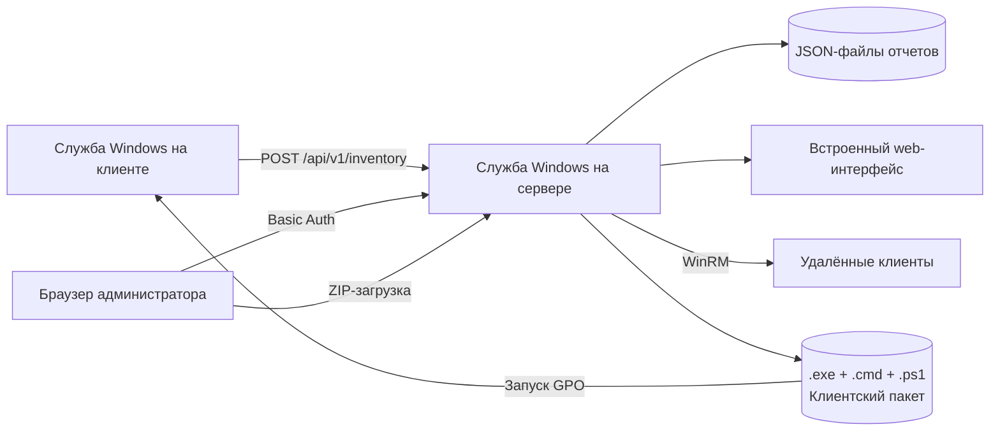

# Windows Inventory Lite

[](https://github.com/didimozg/windows-inventory-lite/releases)
[](https://github.com/didimozg/windows-inventory-lite/actions/workflows/ci.yml)
[](./LICENSE)

## Описание

Windows Inventory Lite — легкий инструмент инвентаризации для небольших сетей Windows, где полноценная система управления активами избыточна. Собирает данные об установленном ПО, базовых аппаратных характеристиках, версии ОС и состоянии активации Office на рабочих станциях и серверах.

Клиент и сервер — небольшие самодостаточные службы на C# с целевой платформой .NET Framework 3.5. Сервер может работать как на Windows Server, так и на обычном компьютере с настольной Windows — IIS, SQL Server, Python, Node.js и NuGet-пакеты не нужны. Клиент разворачивается на компьютеры через WinRM прямо из web-интерфейса или через сценарий запуска компьютера в GPO.

## Возможности

- Клиент работает как служба Windows на Windows 7, 8, 10 и 11.
- Сервер работает как служба Windows на Windows Server или настольной Windows.
- Отчет содержит версию ОС, номер сборки, архитектуру, производителя, модель, серийный номер, IP-адреса, версию Office, факты активации и список установленного ПО.
- Аппаратная инвентаризация включает: процессор (модель, количество ядер, тактовая частота), ОЗУ (количество модулей, объем и производитель каждого, суммарный объем), накопители (тип HDD/SSD, объем, модель). USB-накопители выделяются отдельно.
- Web-интерфейс содержит пять вкладок: Clients, Software, Hardware, Client actions и Client package.
- Вкладка Clients показывает для каждого компьютера сводку по оборудованию (CPU, ОЗУ, накопители) и список ПО в развернутой строке детализации.
- Вкладка Hardware группирует компьютеры по модели процессора, накопителю и конфигурации ОЗУ.
- Все вкладки поддерживают сортировку по столбцам и экспорт в CSV с разделителем «;» для прямого открытия в Excel.
- Web-интерфейс показывает версию сервера и версию клиентского агента.
- Хосты можно удалять из web-интерфейса, если запись больше не нужна.
- Из web-интерфейса можно устанавливать, обновлять и удалять клиенты через WinRM.
- Вкладка Client package показывает версии клиентских исполняемых файлов и текущие настройки CMD-файла, позволяет обновить адрес сервера, токен приема и интервал отчетности, а также скачать готовый GPO-пакет в виде ZIP-архива.
- Скрипты развертывания через GPO поддерживают первичную установку и обновление клиента.
- GPO-пакет содержит отдельные сборки клиента под .NET 3.5 и .NET 4, чтобы Windows 8/10/11 не запрашивали установку .NET 3.5.
- Basic Auth может защищать web-интерфейс и web API.
- Токен приема отчетов может ограничивать отправку клиентских отчетов.

## Архитектура



Клиент собирает данные через WMI и чтение реестра. Он пишет локальный JSON в `ProgramData` и отправляет тот же JSON на сервер. Сервер хранит по одному JSON-файлу на компьютер. Web-интерфейс строит все вкладки по этим серверным JSON-файлам.

Вкладка `Client actions` отправляет команды установки, обновления или удаления клиента на удалённые хосты по WinRM. Вкладка `Client package` позволяет настроить пакет и скачать его в виде ZIP для развёртывания через GPO.

## Требования

Клиент:

- Windows 7, 8, 10 или 11
- .NET Framework 3.5 или новее
- Встроенный Windows PowerShell для скриптов установки
- Сетевой доступ к HTTP-порту сервера

Сервер:

- Windows Server или настольная Windows
- .NET Framework 3.5 или новее
- Встроенный Windows PowerShell для скриптов установки
- Один TCP-порт для встроенного HTTP-сервера

Хост для сборки:

- Windows с локальным компилятором C# из .NET Framework
- Windows PowerShell 5.1 или PowerShell 7 для сборки и установки

## Сборка

Сборка сервера:

```powershell
.\src\Build-Server.ps1
```

Сборка клиента по умолчанию:

```powershell
.\src\Build-Client.ps1
```

Сборка GPO-пакета с двумя целевыми версиями .NET Framework для клиента:

```powershell
.\src\New-ClientGpoPackage.ps1 `
    -ServerUrl 'http://inventory.example.local:8080/api/v1/inventory' `
    -OutputPath '.\dist\gpo-client'
```

Если `.cmd`-обертка лежит в SYSVOL, а PowerShell-скрипт и клиентские `.exe` лежат в другой сетевой папке, укажите путь к этой папке:

```powershell
.\src\New-ClientGpoPackage.ps1 `
    -ServerUrl 'http://inventory.example.local:8080/api/v1/inventory' `
    -OutputPath '.\dist\gpo-client' `
    -PackageSharePath '\\fileserver.example.local\software\windows-inventory-lite'
```

После установки сервера адрес сервера, токен и интервал отчетности в `Install-ClientGpo.cmd` можно изменить через вкладку `Client package` в web-интерфейсе без повторной сборки. Там же можно скачать готовый ZIP-пакет.

## Установка сервера

Запустите установку сервера из PowerShell с правами администратора:

```powershell
.\src\Install-Server.ps1 -ListenPrefix 'http://+:8080/' -OpenFirewall
```

Установка сервера с Basic Auth:

```powershell
.\src\Install-Server.ps1 `
    -ListenPrefix 'http://+:8080/' `
    -OpenFirewall `
    -WebUsername 'inventory-admin' `
    -WebPassword 'replace-with-a-strong-password'
```

Установщик пишет настройки в `C:\ProgramData\WindowsInventoryLite\server-config.json`. При следующих обновлениях он переиспользует сохраненные `ListenPrefix`, пути, `Token`, `WebUsername` и `WebPassword`, если вы не передали новые значения.

Адрес web-интерфейса:

```text
http://inventory.example.local:8080/
```

## Установка клиента

Установка одного клиента из PowerShell с правами администратора:

```powershell
.\src\Install-Client.ps1 `
    -ServerUrl 'http://inventory.example.local:8080/api/v1/inventory' `
    -IntervalHours 6
```

Разовый локальный сбор без установки службы:

```powershell
.\src\Collect-WindowsInventoryLite.ps1 -OutputPath '.\output\localhost.json'
```

Разовый сбор через собранный клиент:

```powershell
.\build\WindowsInventoryLiteClient.exe `
    --once `
    --server-url 'http://inventory.example.local:8080/api/v1/inventory'
```

## Развертывание через GPO

Используйте сценарий запуска компьютера, а не сценарий входа пользователя. Скрипт развертывания создает или обновляет службу Windows и требует прав локального администратора. Сценарии запуска компьютера выполняются от имени компьютера и могут управлять службами.

Порядок развертывания:

1. Соберите пакет через `New-ClientGpoPackage.ps1`.
2. Скопируйте пакет в сетевую папку, доступную учетным записям компьютеров.
3. Выдайте целевым компьютерам право чтения файлов пакета.
4. Выдайте целевым компьютерам право чтения сетевой папки пакета.
5. Добавьте `Install-ClientGpo.cmd` как GPO-сценарий запуска компьютера.
6. Перезагрузите целевые компьютеры или дождитесь следующего запуска сценария.

Скрипт развертывания пишет локальный лог в `C:\ProgramData\WindowsInventoryLite\Logs\gpo-deploy.log`.
Запись центрального лога в сетевую папку пакета оставлена в скрипте как закомментированный код и по умолчанию отключена.

Для обновления замените файлы пакета в сетевой папке. Скрипт развертывания сравнит версию клиента в пакете с установленной версией и пропустит компьютеры, где версия уже совпадает.

## Принудительные действия с клиентом через WinRM

Вкладка `Client actions` в web-интерфейсе может установить, обновить или удалить клиент на одном хосте, списке хостов, одном IP-адресе или простом IPv4-диапазоне, например `192.0.2.10-192.0.2.20`.

Требования:

- WinRM включен на целевых компьютерах.
- Учетная запись серверной службы имеет права администратора на целевых компьютерах.
- Учетной записи серверной службы разрешено подключение по WinRM.
- На сервере есть локальный клиентский пакет с `Deploy-ClientGpo.ps1`, `WindowsInventoryLiteClient-net35.exe` и `WindowsInventoryLiteClient-net40.exe`.

Если цели указаны IP-адресами, Windows не сможет использовать обычную Kerberos-аутентификацию. Используйте один из вариантов:

- Указывать DNS-имена компьютеров вместо IP-адресов.
- Использовать WinRM по HTTPS.
- Указать явные учетные данные WinRM в web-интерфейсе и включить `Add to TrustedHosts`.

Соберите клиентский пакет перед установкой или обновлением сервера:

```powershell
.\src\New-ClientGpoPackage.ps1 `
    -ServerUrl 'http://inventory.example.local:8080/api/v1/inventory' `
    -OutputPath '.\dist\gpo-client'
```

`Install-Server.ps1` копирует `.\dist\gpo-client` в `C:\ProgramData\WindowsInventoryLite\client-package`, если такая папка существует. Также можно передать `-ClientPackageSourcePath` и `-ClientPackagePath`.

После установки адрес сервера, токен и интервал в `Install-ClientGpo.cmd` можно скорректировать через вкладку `Client package` в web-интерфейсе без повторного запуска сборки.

Если серверная служба работает от имени LocalSystem, установка по WinRM на удаленные компьютеры обычно не сработает. Запускайте службу от доменной учетной записи с нужными правами локального администратора или используйте управляемую сервисную учетную запись с такими же правами.
Не передавайте пароль WinRM через web-интерфейс по обычному HTTP за пределами доверенной сети администрирования.

Сервер хранит логи заданий WinRM в `DataPath\_client-install-jobs`. Срок хранения по умолчанию составляет 30 дней. Другой срок можно задать при установке сервера:

```powershell
.\src\Install-Server.ps1 `
    -ListenPrefix 'http://+:8080/' `
    -InstallLogRetentionDays 60
```

Вкладка `Client actions` также позволяет задать срок хранения для отдельного задания. В сохраненный лог попадают действие, цели, статус, вывод команды, ошибки, временные метки и имя пользователя WinRM. Пароли в файлы логов не записываются.

## Работа с web-интерфейсом

Web-интерфейс содержит пять вкладок:

- `Clients`: одна строка на компьютер, с ОС, Office, состоянием активации, количеством ПО, временем отчета и версией агента. Компьютеры с USB-накопителями помечаются значком. Нажмите имя компьютера, чтобы открыть детализацию: сводку по оборудованию (CPU, ОЗУ, накопители) и полный список ПО.
- `Software`: одна строка на имя ПО, версию и издателя, с количеством установок и списком компьютеров. Нажмите имя ПО, чтобы развернуть список.
- `Hardware`: три сгруппированные таблицы. CPUs — компьютеры, сгруппированные по модели процессора. Storage — по модели, типу и объему накопителя. RAM — по суммарному объему памяти и количеству модулей. USB-накопители выделяются цветом. Нажмите строку группы, чтобы развернуть список компьютеров.
- `Client actions`: действия WinRM — установка, обновление или удаление клиента на одном хосте, списке хостов или диапазоне IPv4.
- `Client package`: показывает версии клиентских `.exe` и текущие настройки `Install-ClientGpo.cmd`. Позволяет изменить адрес сервера, токен и интервал отчетности, а также скачать готовый GPO-пакет в виде ZIP-архива.

Все вкладки поддерживают сортировку по столбцам. Нажмите заголовок столбца для сортировки по возрастанию, повторное нажатие — по убыванию.

Каждая вкладка имеет кнопку `Export CSV`. Файл использует разделитель «;» и BOM UTF-8 — в Excel с российской или европейской локалью он открывается напрямую. Экспорт учитывает текущий фильтр поиска и активную сортировку.

Удаление хоста из web-интерфейса удаляет серверный JSON-отчет этого хоста. Если клиентская служба продолжает работать и видит сервер, хост появится снова после следующей синхронизации.

`Stale >48h` показывает отчеты старше 48 часов или отчеты с некорректной меткой времени.

## Параметры

### Collect-WindowsInventoryLite.ps1

| Параметр | По умолчанию | Описание |
| -------- | ------------ | -------- |
| `-OutputPath` | `—` | Путь к выходному JSON-файлу отчета. |
| `-ServerSharePath` | `—` | UNC-путь к серверной папке для сброса отчетов. Если указан, отчет дополнительно копируется туда. |
| `-SkipSoftware` | `off` | Не собирать список установленного ПО. |

### Install-Server.ps1

| Параметр | По умолчанию | Описание |
| -------- | ------------ | -------- |
| `-ListenPrefix` | `http://+:8080/` | HTTP-префикс для слушателя серверной службы. |
| `-DataPath` | `—` | Папка для полученных JSON-отчетов. По умолчанию: `C:\ProgramData\WindowsInventoryLite\drop`. |
| `-InstallPath` | `—` | Папка установки серверной службы. По умолчанию: `C:\ProgramData\WindowsInventoryLite`. |
| `-ContentPath` | `—` | Папка с HTML, CSS и JavaScript web-интерфейса. По умолчанию: `InstallPath\dashboard`. |
| `-ClientPackagePath` | `—` | Целевая папка для клиентского пакета на сервере. По умолчанию: `InstallPath\client-package`. |
| `-ClientPackageSourcePath` | `—` | Исходная папка для копирования клиентского пакета перед установкой. |
| `-ConfigPath` | `—` | Путь к файлу конфигурации сервера. По умолчанию: `InstallPath\server-config.json`. |
| `-ServerExecutablePath` | `—` | Путь к заранее собранному серверному исполняемому файлу. Если не указан, запускается сборка. |
| `-Token` | `—` | Токен приема отчетов, ожидаемый в заголовке `X-Inventory-Token`. Необязателен. |
| `-WebUsername` | `—` | Имя пользователя Basic Auth для web-интерфейса и web API. Необязателен. |
| `-WebPassword` | `—` | Пароль Basic Auth для web-интерфейса и web API. Необязателен. |
| `-InstallLogRetentionDays` | `30` | Срок хранения логов клиентских действий WinRM в днях. |
| `-OpenFirewall` | `off` | Создать входящее правило Windows Firewall для порта слушателя. |
| `-NoRun` | `off` | Установить и настроить службу без запуска. |

### Install-Client.ps1

| Параметр | По умолчанию | Описание |
| -------- | ------------ | -------- |
| `-ServerUrl` | `—` | HTTP-адрес для отправки клиентских JSON-отчетов. Обязателен. |
| `-ServerSharePath` | `—` | UNC-путь к серверной папке для прямой доставки файлов. Необязателен. |
| `-Token` | `—` | Токен приема, отправляемый в заголовке `X-Inventory-Token`. Необязателен. |
| `-IntervalHours` | `6` | Интервал сбора данных в часах (1–24). |
| `-InstallPath` | `—` | Папка установки клиентской службы. По умолчанию: `C:\ProgramData\WindowsInventoryLite`. |
| `-ClientExecutablePath` | `—` | Путь к заранее собранному клиентскому исполняемому файлу. Если не указан, запускается сборка. |
| `-NoRun` | `off` | Установить и настроить службу без запуска. |

### Install-ClientWinRM.ps1

| Параметр | По умолчанию | Описание |
| -------- | ------------ | -------- |
| `-ComputerName` | `—` | Одно или несколько имен компьютеров или IP-адресов. Обязателен. |
| `-ServerUrl` | `—` | HTTP-адрес для отправки клиентских JSON-отчетов. Обязателен. |
| `-Token` | `—` | Токен приема, отправляемый в заголовке `X-Inventory-Token`. Необязателен. |
| `-IntervalHours` | `6` | Интервал сбора данных в часах (1–24). |
| `-PackagePath` | `—` | Локальный путь к GPO-пакету клиента. По умолчанию: `dist\gpo-client`. |
| `-RemotePackagePath` | `C:\ProgramData\WindowsInventoryLite\WinRMDeploy` | Временная папка на удаленном хосте для пакета. |
| `-Credential` | `—` | PSCredential для аутентификации WinRM. Необязателен. |
| `-CredentialUsername` | `—` | Имя пользователя WinRM в виде строки. Используется, если не указан `-Credential`. |
| `-CredentialPassword` | `—` | Пароль WinRM в виде строки. Используется, если не указан `-Credential`. |
| `-AddToTrustedHosts` | `off` | Добавить целевые компьютеры в WinRM TrustedHosts перед подключением. |
| `-Force` | `off` | Переустановить клиент, даже если версия уже совпадает. |
| `-KeepRemotePackage` | `off` | Не удалять временную папку пакета на удаленном хосте после развертывания. |

### Uninstall-Client.ps1

| Параметр | По умолчанию | Описание |
| -------- | ------------ | -------- |
| `-InstallPath` | `C:\ProgramData\WindowsInventoryLite` | Папка установки для удаления. |

### Uninstall-ClientWinRM.ps1

| Параметр | По умолчанию | Описание |
| -------- | ------------ | -------- |
| `-ComputerName` | `—` | Одно или несколько имен компьютеров или IP-адресов. Обязателен. |
| `-InstallPath` | `C:\ProgramData\WindowsInventoryLite` | Папка установки для удаления на удаленных хостах. |
| `-Credential` | `—` | PSCredential для аутентификации WinRM. Необязателен. |
| `-CredentialUsername` | `—` | Имя пользователя WinRM в виде строки. Используется, если не указан `-Credential`. |
| `-CredentialPassword` | `—` | Пароль WinRM в виде строки. Используется, если не указан `-Credential`. |
| `-AddToTrustedHosts` | `off` | Добавить целевые компьютеры в WinRM TrustedHosts перед подключением. |

### New-ClientGpoPackage.ps1

| Параметр | По умолчанию | Описание |
| -------- | ------------ | -------- |
| `-ServerUrl` | `—` | HTTP-адрес, встраиваемый в скрипт запуска клиента. Обязателен. |
| `-Token` | `—` | Токен приема, встраиваемый в скрипт запуска клиента. Необязателен. |
| `-IntervalHours` | `6` | Интервал сбора в часах, встраиваемый в скрипт запуска клиента (1–24). |
| `-OutputPath` | `—` | Выходная папка для пакета. По умолчанию: `dist\gpo-client`. |
| `-ClientNet35Path` | `—` | Путь к заранее собранному клиентскому `.exe` под .NET 3.5. Если не указан, запускается сборка. |
| `-ClientNet40Path` | `—` | Путь к заранее собранному клиентскому `.exe` под .NET 4. Если не указан, запускается сборка. |
| `-PackageSharePath` | `—` | UNC-путь к сетевой папке, встраиваемый в `.cmd`-обертку, когда исполняемые файлы и скрипт находятся в папке, отдельной от SYSVOL. |

### Build-Server.ps1

| Параметр | По умолчанию | Описание |
| -------- | ------------ | -------- |
| `-OutputPath` | `—` | Путь к скомпилированному серверному исполняемому файлу. По умолчанию: `build\WindowsInventoryLiteServer.exe`. |

### Build-Client.ps1

| Параметр | По умолчанию | Описание |
| -------- | ------------ | -------- |
| `-OutputPath` | `—` | Путь к скомпилированному клиентскому исполняемому файлу. По умолчанию: `build\WindowsInventoryLiteClient.exe`. |
| `-TargetFramework` | `Net40` | Целевая версия .NET Framework: `Net35` или `Net40`. |

### Build-InventoryIndex.ps1

| Параметр | По умолчанию | Описание |
| -------- | ------------ | -------- |
| `-DropPath` | `C:\ProgramData\WindowsInventoryLite\drop` | Папка с JSON-отчетами от клиентов. |
| `-DashboardDataPath` | `C:\inetpub\WindowsInventoryLite\data` | Выходная папка для сгенерированного индекса инвентаря. |

### Deploy-ClientGpo.ps1

| Параметр | По умолчанию | Описание |
| -------- | ------------ | -------- |
| `-ServerUrl` | `—` | HTTP-адрес для отправки клиентских JSON-отчетов. Обязателен. |
| `-Token` | `—` | Токен приема, отправляемый в заголовке `X-Inventory-Token`. Необязателен. |
| `-IntervalHours` | `6` | Интервал сбора данных в часах (1–24). |
| `-InstallPath` | `—` | Папка установки клиентской службы. По умолчанию: `C:\ProgramData\WindowsInventoryLite`. |
| `-PackageClientPath` | `—` | Путь к клиентскому исполняемому файлу в пакете. Определяется из директории скрипта, если не указан. |
| `-Force` | `off` | Переустановить клиент, даже если версия уже совпадает. |

## Скриншоты

На скриншотах используются примерные имена хостов, документационные IP-адреса и тестовый домен.


## Конфигурация

- `ServerUrl`: HTTP-адрес для приема клиентских JSON-файлов.
- `IntervalHours`: интервал сбора на клиенте от 1 до 24 часов.
- `ListenPrefix`: префикс HTTP-слушателя сервера, например `http://+:8080/`.
- `DataPath`: серверная папка для полученных JSON-файлов.
- `ContentPath`: серверная папка для HTML, CSS и JavaScript web-интерфейса.
- `ConfigPath`: файл конфигурации сервера. По умолчанию `C:\ProgramData\WindowsInventoryLite\server-config.json`.
- `InstallLogRetentionDays`: срок хранения логов клиентских действий через WinRM. По умолчанию `30`.
- `Token`: общий токен, который клиент отправляет в заголовке `X-Inventory-Token`.
- `WebUsername` и `WebPassword`: учетные данные Basic Auth для web-интерфейса и web API.

## Безопасность

- Сборщик сохраняет только факт активации. Ключи продуктов не экспортируются.
- Basic Auth защищает доступ через браузер, но обычный HTTP не шифрует учетные данные. Используйте завершение HTTPS или ограничьте доступ доверенными сетями администрирования.
- Ограничьте отправителей inventory-отчетов через `-Token`, правила Firewall и сетевые ACL.
- Не кладите чувствительный токен в SYSVOL-скрипт с широким доступом на чтение. Для развертывания через GPO лучше использовать ограничение по Firewall или токен приема отчетов с низкой ценностью.
- Если включаете закомментированную запись центрального GPO-лога, ограничьте право записи в эту папку только нужными учетными записями компьютеров.
- Перед публикацией сервера за пределы сети администрирования прочитайте [docs/threat-model.md](./docs/threat-model.md).

## Удаление

Удаление клиентской службы и локальных файлов клиента:

```powershell
.\src\Uninstall-Client.ps1
```

## Структура проекта

- `src/`: сборщик, скрипты сборки, скрипты установки и исходный код служб.
- `src/client/`: самостоятельный C# клиент как служба Windows.
- `src/server/`: самостоятельный C# сервер как служба Windows и встроенный web-интерфейс.
- `deploy/client/`: скрипт развертывания через GPO и командная обертка.
- `server/dashboard/`: статические файлы web-интерфейса, которые копирует установщик сервера.
- `docs/`: threat model и заметки по эксплуатационной безопасности.
- `examples/`: примеры установки и разового запуска.
- `tests/`: проверки синтаксиса и языка.

## Лицензия

[MIT License](./LICENSE). Copyright (c) 2026 didimozg.
