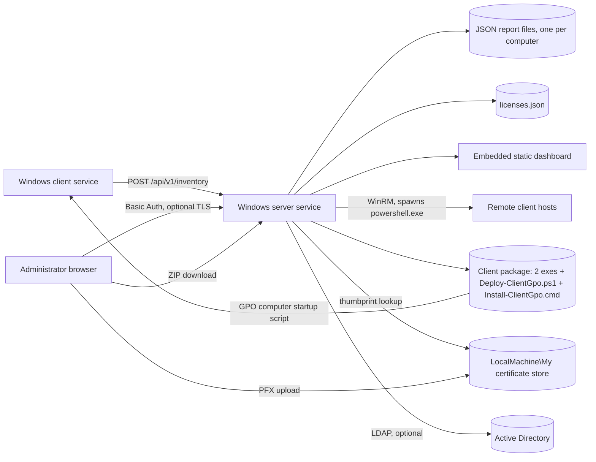

# Windows Inventory Lite — Project Specification

**Current version:** 0.21.3 (server/dashboard). Client agent versioned independently since 0.16.7 (currently 0.2.x line) - see [Versioning Model](#versioning-model).

**Status:** Production, actively maintained. First shipped as "Windows Inventory Lite" at v0.1.0 (2026-06-11), evolved from an earlier internal tool of the same lineage.

This document is a complete, standalone technical specification of the project as it exists today - what it does, how every piece works, why it's built the way it is, and how it got here. It is meant to be readable without any other context: a new maintainer should be able to pick up the whole system from this file plus the source it points at.

---

## Table of Contents

1. [Purpose and Scope](#purpose-and-scope)
2. [Design Constraints](#design-constraints)
3. [Architecture](#architecture)
4. [Repository Layout](#repository-layout)
5. [The Client Agent](#the-client-agent)
6. [The Server](#the-server)
7. [Data Model](#data-model)
8. [The Dashboard](#the-dashboard)
9. [Active Directory Integration](#active-directory-integration)
10. [Client Deployment and Lifecycle Management](#client-deployment-and-lifecycle-management)
11. [Licenses](#licenses)
12. [HTTPS and Certificate Management](#https-and-certificate-management)
13. [Authentication and Access Control](#authentication-and-access-control)
14. [API Reference](#api-reference)
15. [Installation and Build Tooling](#installation-and-build-tooling)
16. [Security Model](#security-model)
17. [Testing Strategy](#testing-strategy)
18. [Versioning Model](#versioning-model)
19. [Project History](#project-history)
20. [Known Limitations and Open Backlog](#known-limitations-and-open-backlog)

---

## Purpose and Scope

Windows Inventory Lite is a lightweight IT asset inventory tool for small-to-medium Windows networks - the gap between "no inventory at all" and "a full enterprise asset-management platform" (SCCM, Lansweeper, etc.) that would be excessive for a shop with a few dozen to a few hundred machines and no dedicated tooling budget.

It tracks, per machine: OS version/build/architecture, hardware (CPU, RAM including per-module detail, storage with type/capacity/model, USB storage presence), installed software, Office version and activation status, Windows activation status, IP addresses, and (optionally) an Active Directory `description` attribute. Administrators view this through a built-in web dashboard, and can install, update, or uninstall the client agent on remote machines directly from that dashboard over WinRM.

The whole system - client, server, and dashboard - is a single, small, dependency-free deliverable: no IIS, no SQL Server, no Node.js, no NuGet packages, no charting library, no CSS/JS framework. This is a deliberate, load-bearing design choice, not an oversight - see [Design Constraints](#design-constraints).

## Design Constraints

These constraints have held since v0.1.0 and shape every subsequent design decision in the project:

- **.NET Framework 3.5 minimum, on both client and server.** This is what ships out of the box on Windows 7 and Windows Server 2008 R2 without any additional runtime install - the target environments are exactly the kind of network that doesn't already have a modern .NET runtime rolled out everywhere. The client and server are separately buildable against 3.5 and 4.0 (the server's own build always targets 3.5 for maximum compatibility; the client ships as two parallel builds, `net35` and `net40`, so a GPO deployment can serve whichever a given target OS needs without triggering a ".NET 3.5 feature required" prompt on newer Windows versions that don't have it enabled by default).
- **No NuGet, no external assemblies beyond the .NET Framework GAC.** Both `WindowsInventoryLiteServer.csproj` and `WindowsInventoryLiteClient.csproj` are compiled directly with `csc.exe` (the framework's own compiler, invoked from `Build-Server.ps1`/`Build-Client.ps1`) rather than through MSBuild/`dotnet build` - there is no package restore step, no lockfile, no internet access required to build. Everything used (HTTP listening via raw `TcpListener`/`SslStream`, JSON via `System.Web.Script.Serialization.JavaScriptSerializer`, WMI via `System.Management`, DPAPI via `System.Security.Cryptography.ProtectedData`) ships in the base framework.
- **No web framework, no bundler, no build step for the dashboard.** `server/dashboard/{index.html,app.js,styles.css}` are plain static files served directly from the compiled server's `--content` directory - vanilla JavaScript (no React/Vue/jQuery), hand-written CSS (no Tailwind/Bootstrap), no charting library (bar charts are literally styled `<div>` widths). The dashboard is embedded in the server executable's working directory, not a separate deployable artifact.
- **PowerShell 5.1 compatibility for anything that runs on the server/build machine** (`Install-Server.ps1`, `Install-Wizard.ps1`, `New-ClientGpoPackage.ps1`, `Build-Server.ps1`, `Build-Client.ps1`) - this project assumes the server host is not itself running anything older. **PowerShell 2.0 compatibility for anything that runs on a client machine directly** (`Install-Client.ps1`, `Collect-WindowsInventoryLite.ps1`) - client machines in this project's target environment can genuinely still be running Windows 7 with an unpatched PowerShell version, and this constraint has bitten the project in practice more than once (see [Project History](#project-history), v0.16.1's `$PSScriptRoot` fix).
- **Hand-rolled implementations over dependencies, when the alternative is a heavy dependency for a small piece of functionality.** The HTTP server is a raw `TcpListener` accept loop with a hand-written header parser and `SslStream`-wrapped HTTPS, not `HttpListener` or a web framework (`HttpListener` needs a URL ACL reservation or admin rights to bind non-loopback prefixes on non-elevated setups, which this project's install flow avoids). ZIP archives for the GPO deployment package are built in-process with a minimal uncompressed PKZIP writer (`BuildZip`, see [The Server](#the-server)) rather than depending on `System.IO.Compression` (only available from .NET 4.5, above this project's floor). Constant-time string comparison, DPAPI secret wrapping, and RFC 4515 LDAP filter escaping are all hand-implemented for the same reason.
- **English-only codebase, bilingual documentation.** All code, comments, UI text, and API responses are English, regardless of the fact that this project's actual primary maintainer and user base communicate in Russian - `README.md` and `README_RU.md` are separately maintained (not mechanically translated from one another) so each reads naturally in its own language, and this specification follows the same convention.

## Architecture



**Data flow, end to end:**

1. The client agent runs as a Windows Service (or a one-shot `--once` invocation from a scheduled task), collects a snapshot via WMI/registry reads, writes it to a local JSON file under `%ProgramData%\WindowsInventoryLite\`, and `POST`s the same JSON to the server's `/api/v1/inventory` endpoint on a configurable interval.
2. The server (also a Windows Service) receives the report, optionally merges in fresh or cached AD data (see [Active Directory Integration](#active-directory-integration)), and writes it as one JSON file per computer name under its own `DataPath`. No database - the server's own data store is a directory of JSON files.
3. An administrator's browser talks to the same server process over HTTP or HTTPS, authenticated with Basic Auth (optional but strongly recommended once exposed beyond `localhost`). The dashboard is a set of static files the server serves from its `--content` directory; all dynamic data comes from a family of `/api/v1/*` JSON endpoints the same server process also handles.
4. From the `Client actions`/`Client updates` dashboard tabs, an administrator can trigger install/update/uninstall jobs against one or more remote target machines. The server does this by spawning a local `powershell.exe` process per target, which opens a WinRM (`New-PSSession`) connection to the target and runs `Deploy-ClientGpo.ps1` remotely to install or update the client service there - the server itself never needs inbound WinRM access to targets to be configured ahead of time beyond normal WinRM prerequisites (see [Client Deployment and Lifecycle Management](#client-deployment-and-lifecycle-management)).
5. For GPO-based deployment (as an alternative to WinRM push), the server can produce a self-contained "client package" - both client executables (net35/net40), the deploy script, and a pre-configured `.cmd` wrapper - as a downloadable ZIP, meant to be placed in SYSVOL and run by a GPO computer startup script on every domain machine.

## Repository Layout

```
windows-inventory-lite/
├── src/
│   ├── client/
│   │   ├── WindowsInventoryLiteClient.cs      # Client agent: collection + service host + HTTP POST
│   │   ├── WindowsInventoryLiteClient.csproj  # csc.exe project file (net35/net40 dual target)
│   │   └── AssemblyInfo.cs                    # Win32 version resource metadata
│   ├── server/
│   │   ├── WindowsInventoryLiteServer.cs      # The whole server: HTTP(S), all API endpoints, WinRM
│   │   │                                      #   orchestration, AD sync scheduling, self-tests (~5700 lines)
│   │   ├── AdLookupService.cs                 # LDAP lookups: single-computer description, OU-scoped search
│   │   ├── SecretProtector.cs                 # DPAPI wrap/unwrap for secrets at rest
│   │   ├── DebugLogger.cs                     # Optional plain-text diagnostic log
│   │   ├── WindowsInventoryLiteServer.csproj
│   │   └── AssemblyInfo.cs
│   ├── Build-Server.ps1                       # Compiles the server (+ both client targets as a side effect)
│   ├── Build-Client.ps1                       # Compiles one client target directly
│   ├── Build-InventoryIndex.ps1                # Utility: rebuilds a JSON index from report files
│   ├── Install-Server.ps1                     # Server install/reconfigure (~960 lines, every server setting)
│   ├── Install-Client.ps1                     # Local client install (runs ON the target machine)
│   ├── Install-ClientWinRM.ps1                # Remote client install FROM the server, over WinRM
│   ├── Uninstall-Server.ps1
│   ├── Uninstall-Client.ps1                   # Local uninstall
│   ├── Uninstall-ClientWinRM.ps1              # Remote uninstall over WinRM
│   ├── Install-Wizard.ps1                     # Interactive menu wrapping all of the above
│   ├── New-ClientGpoPackage.ps1               # Builds a standalone GPO deployment package
│   └── Collect-WindowsInventoryLite.ps1        # PowerShell-only client alternative (no compiled exe needed)
├── deploy/client/
│   ├── Deploy-ClientGpo.ps1                   # Runs ON the target: install/update the client service,
│   │                                          #   idempotent, version-aware. Used by BOTH the WinRM push
│   │                                          #   path and the GPO startup-script path.
│   └── Install-ClientGpo.cmd                  # Thin GPO startup-script wrapper generated by the server/
│                                              #   New-ClientGpoPackage.ps1, calls Deploy-ClientGpo.ps1
├── server/dashboard/
│   ├── index.html                             # All dashboard views, static markup
│   ├── app.js                                 # All dashboard behavior (~2750 lines)
│   ├── styles.css                             # All dashboard styling (~1500 lines)
│   └── favicon.svg
├── tests/
│   ├── SelfTest.Tests.ps1                     # Pester wrapper invoking the server's own `--self-test`
│   ├── ScriptSyntax.Tests.ps1                 # Parses every .ps1, enforces English-only source
│   ├── Install-Wizard.Tests.ps1               # Wizard flows via canned answers, no real interaction
│   └── New-ClientGpoPackage.Tests.ps1         # Injection-guard tests for the GPO package builder
├── docs/
│   ├── threat-model.md                        # Assets, trust boundaries, invariants, risks, controls
│   ├── project-specification.md               # This document
│   └── images/                                # Dashboard screenshots + logo, used by both READMEs
├── examples/                                   # Minimal example invocations of the install scripts
├── .github/workflows/ci.yml                    # Pester + build on every push
├── README.md / README_RU.md                    # User-facing documentation, English/Russian
├── CHANGELOG.md                                # Full version history, Keep a Changelog format
└── LICENSE                                     # MIT
```

## The Client Agent

**File:** `src/client/WindowsInventoryLiteClient.cs`. Compiled to two parallel executables (`WindowsInventoryLiteClient-net35.exe`, `WindowsInventoryLiteClient-net40.exe`) from the same source, targeting .NET Framework 3.5 and 4.0 respectively - a deployment picks whichever matches the target OS to avoid an unwanted ".NET 3.5 features" install prompt on newer Windows.

Runs as a Windows Service (`WindowsInventoryLiteClient`) on Windows 7/8/10/11, or as a one-shot `--once` process invoked from a scheduled task (an alternative some deployments prefer over a long-running service). On each collection cycle:

1. Reads OS version/build/architecture (`Win32_OperatingSystem`), hardware vendor/model/serial number (`Win32_ComputerSystem`/`Win32_BIOS`), CPU (`Win32_Processor` - model, core count, clock speed), RAM (`Win32_PhysicalMemory` - per-module capacity/manufacturer/speed, not just the total), storage (`Win32_DiskDrive`/`MSFT_PhysicalDisk` - type HDD/SSD, capacity, model; USB-attached disks flagged separately), IP addresses, Office version and activation status, Windows activation status, and the full installed-software list (from the Uninstall registry keys, both 32- and 64-bit views).
2. Writes the resulting JSON to a local file under `%ProgramData%\WindowsInventoryLite\` (its own local cache/audit trail, independent of whether the server is reachable).
3. `POST`s the same JSON to the configured server URL's `/api/v1/inventory` endpoint, with an optional `X-Inventory-Token` header if the server has ingestion token enforcement enabled.
4. Logs unhandled collection failures to the Windows Event Log (a real Warning entry as of v0.5.0 - an earlier version's catch block claimed to do this but was empty, so a persistently-failing agent silently reported nothing).
5. Optionally writes a plain-text debug log (`--debug-log-enabled`, off by default) covering client-server report traffic and unhandled errors, independent of the Event Log.

**Networking:** the client negotiates TLS 1.2 explicitly when talking to an HTTPS server (`SslProtocols.Tls12`, not "negotiate any" - some .NET Framework builds treat the auto-negotiate value as "no protocols enabled" and reject the handshake outright, fixed in v0.5.0 after this masked itself as a routing problem in practice).

**Versioning:** decoupled from the server/dashboard version since v0.16.7 (see [Versioning Model](#versioning-model)) - the client's own version only changes when client-collected data or client-side behavior actually changes, so a server-only release doesn't spuriously mark every already-deployed client as "outdated" in the `Client updates` dashboard tab.

**Alternative to the compiled client:** `src/Collect-WindowsInventoryLite.ps1` is a PowerShell-only implementation of the same collection logic, for environments that prefer a script over a compiled service (no installation, no Windows Service - typically run from a scheduled task). Kept PowerShell-2.0-compatible for the same reason as `Install-Client.ps1`.

## The Server

**File:** `src/server/WindowsInventoryLiteServer.cs` - the entire server in one file, by design (this project's own established convention is large, focused single-purpose files over premature module splitting; the file has grown to roughly 5,700 lines and has been through several whole-codebase reviews confirming its internal organization, not just its size, holds up). Companion files: `AdLookupService.cs` (LDAP), `SecretProtector.cs` (DPAPI), `DebugLogger.cs` (diagnostic logging).

**Listener:** a raw `TcpListener` accept loop, one thread per connection (via the .NET ThreadPool), with a hand-rolled HTTP/1.1 request parser (`FindHeaderEnd` locates the header/body boundary across however many reads it takes to arrive - self-tested directly, including the case where the terminator sequence is split across two reads). HTTP and HTTPS run as two fully independent listeners on two independent ports (default `8080`/`8443`), each start/stop/rebind independently - a design chosen specifically so that enabling/disabling one can never accidentally take down the other, and so the dashboard's "disable HTTP" safety gate (see below) has something concrete to check. HTTPS wraps accepted sockets in `SslStream`, resolving the configured certificate from the `LocalMachine\My` store by thumbprint - no certificate file path, no `netsh http` binding step; changing the certificate, moving a port, or toggling either listener takes effect live, without a service restart, once the certificate is already registered in the store.

Every accepted socket gets an explicit 30-second read/write timeout (a stalled handshake or a client that opens a socket and never sends anything can't tie up a thread indefinitely) and negotiates TLS 1.2 explicitly on the HTTPS side, for the same .NET-Framework-auto-negotiate reason as the client.

**Request routing** is a long `if`/`else if` chain matching `(request.Method, request.Path)` pairs against handler methods - see [API Reference](#api-reference) for the full list. Static dashboard files (`/`, `/app.js`, `/styles.css`, `/favicon.svg`) are served from the `--content` directory alongside the JSON API.

**Data storage:** one JSON file per computer under `options.DataPath` (default `%ProgramData%\WindowsInventoryLite\server-data`), serialized with `JavaScriptSerializer` (the framework's own JSON serializer, no external library). Report writes are serialized behind a single `reportFileLock` to prevent concurrent-write corruption; slow operations that a write might otherwise need to wait on (a live AD lookup, which can take up to ~15 seconds against an unreachable domain controller) are deliberately computed *before* acquiring that lock, so one slow AD lookup can never serialize ingestion for the rest of the fleet behind it.

**Self-tests:** the server executable has a built-in `--self-test` mode (58 checks as of v0.21.3) exercising every pure/hand-rolled piece of logic that would otherwise have no automated coverage in a NuGet-free project with no test framework: the HTTP header parser, WinRM target/IP-range expansion, the in-process ZIP builder, certificate thumbprint normalization, license ID parsing, credential-resolution fallback chains, the AD-sync flag split and its migration, and more. `tests/SelfTest.Tests.ps1` wraps this in Pester for CI. **Known environment quirk** (documented in project memory, not in the tests themselves): Pester must be invoked via Windows PowerShell 5.1 (`powershell.exe`), not PowerShell 7 (`pwsh`) - one specific test that reads a config file touches a `System.Web.UI.WebResourceAttribute` type that only resolves via the .NET Framework GAC, which `pwsh`'s .NET Core runtime doesn't have, producing a reproducible false failure that has nothing to do with the code under test.

**Background jobs:** the server runs its own in-process timers for AD Description sync sweeps (when in "periodic timer" mode) and the Client Auto-Update schedule (once/interval modes) - both reconfigurable live from the dashboard without a service restart, both persisting their configuration to survive one.

## Data Model

**Client report** (one JSON file per computer, e.g. `DataPath\KLG-WS10-001.json`): `computerName`, `domain`, `ipAddresses` (array), `clientVersion`, `os` (`caption`/`version`/`buildNumber`), `cpu` (`name`/`cores`/`clockMhz`), `ramTotalMb`, `ramModules` (array of `{capacityMb, manufacturer, speedMhz}`), `disks` (array of `{type, sizeGb, model, usb}`), `hasUsbStorage`, `office` (`name`/`version`), `activation` (`windows`/`office`, each `{activated}`), `software` (array of `{name, version, publisher, installDate}`), `collectedAt`/`sourceUpdatedAt` timestamps, and - only when AD Description Sync has ever run for this computer, or a manual edit has ever been made - `adDescription`, `adSyncStatus` (`ok`/`not-found`/`error`), `adSyncedAt`.

**Server config** (`server-config.json`, one file, ACL-restricted to Administrators+SYSTEM, reapplied on every write): every dashboard-configurable and install-time setting - listener ports/enable flags, stale threshold, Basic Auth credentials, ingestion token, WinRM client-update credentials, AD identity/sync settings, client package paths, install-log retention. Secrets (`AdPassword`, `WebPassword`, `Token`, `ClientUpdatePassword`) are DPAPI-encrypted at rest (`LocalMachine` scope) via `SecretProtector`; a plaintext value from an older install is migrated to encrypted form automatically on the next service start, and the file's own ACL is what actually protects these values against being copied off the box (DPAPI at machine scope is decryptable by any sufficiently privileged local process, not a substitute for restricting who can reach the file).

**Licenses catalog** (`licenses.json`): a separate, manually-maintained list independent of collected software inventory - `{id, name, version, license, comment, computers}`, where `computers` links specific machines to a license record either by hand or auto-filled from software already seen in inventory.

**Certificate history** (`_certificates/certificate-history.json`): one entry per PFX ever imported, recording the risks found at upload time - a forensic trail an operator can review to notice an unexpected certificate import.

## The Dashboard

Static files (`index.html`/`app.js`/`styles.css`) served by the same server process; all dynamic content comes from `/api/v1/*` JSON calls. Navigation is a pinned vertical tree sidebar (not a horizontal tab bar - changed in the v0.4.0 era specifically because a growing feature set no longer fit comfortably as tabs): **Dashboard**, **Inventory** (Clients/Software/Hardware), **Licenses**, **Installation** (Client actions/Client package/Client updates), **Settings** (General/Certificate/Change admin password).

- **Dashboard**: the landing page. Tile counts (Clients, Windows activated, Office activated, Stale), a Software card (Licenses count + a top-5-installed-software bar chart), and a Hardware card (USB-storage count + bar-chart breakdowns of CPU model/RAM size/storage type across the fleet) - all plain CSS bars, no charting library.
- **Clients**: the main inventory table. Sortable columns, live search/filter, CSV export (semicolon-delimited for direct Excel opening, with formula-injection mitigation on any field starting with `=`/`+`/`-`/`@`). Each row expands to a details card with CPU/RAM/Storage summaries (RAM modules render as their own 2-column grid, not one long comma-joined line - a UX fix from real fleet feedback). The Description column is either a read-only AD-sourced value or a directly-editable inline field, depending on whether AD Description Sync is on (see [Active Directory Integration](#active-directory-integration)). Stale clients (no report within the configured threshold) carry a visible `STALE` badge. Live auto-refresh every 30 seconds (paused while the browser tab isn't visible), preserving sort/search/pagination/expanded-row state across each refresh.
- **Software / Hardware**: grouped views (by software title+version, or by CPU model/storage device/RAM configuration respectively) with an expandable list of machines per group.
- **Licenses**: the manually-maintained catalog described in [Licenses](#licenses).
- **Client actions**: install, update, or uninstall the client on a single host, a list of hosts, or an IPv4 range, over WinRM - see [Client Deployment and Lifecycle Management](#client-deployment-and-lifecycle-management).
- **Client package**: shows the deployed client executables' versions and the currently-configured GPO `.cmd` settings (server URL, token, interval, package share path); lets an operator reconfigure them and download a ready-to-deploy ZIP.
- **Client updates**: shows which reporting clients are running an outdated version relative to the current client package, with a one-click WinRM push to bring selected ones current, plus an optional automatic push schedule (once at a chosen time, or every N hours).
- **General/Certificate/Change admin password**: server-wide settings, TLS certificate management, and dashboard credential rotation, covered in their own sections below.

Cross-cutting dashboard conventions worth knowing before touching the code: `escapeHtml`/`escapeHtmlOrEmpty` are the ONE sanctioned way any server-provided or user-entered text reaches the DOM (report fields, license text, AD-sourced descriptions are all untrusted display data per the threat model); a shared `showSavedMessage` helper drives every settings panel's save confirmation (auto-hides after 30s, tracks its own per-element timer so repeated saves don't stack); `state.expandedDetails` (a `Set` of prefixed keys) makes expand/collapse state survive any re-render rather than being pure DOM state, so a live-poll refresh or a pager click can never silently collapse something the operator had open.

## Active Directory Integration

Optional, off by default, and independent of everything else in the project - a deployment that never touches AD is completely unaffected by any of this. Three related but genuinely separate features share the same underlying AD identity (domain + credentials, either the server's own Windows Service identity or an explicit saved account):

1. **AD Description Sync** - looks up each reporting computer's AD `description` attribute and shows it as a column in the Clients table. Two sync modes: **on inventory report** (default - refreshes when a computer next reports, if the cached value is older than the configured interval) and **periodic timer** (refreshes every known computer on a fixed schedule, including ones that have stopped reporting). Governed by its own toggle, "Sync Description from AD" (`AdDescriptionSyncEnabled`), independent of whether AD identity itself is configured.
2. **AD-editable Description** - when "Sync Description from AD" is OFF, the same Description column becomes directly, manually editable inline in the Clients table (column header switches from "AD Description" to plain "Description"). A manual edit persists across the client's own future inventory reports (the report-ingestion path explicitly carries the value forward when sync is off, rather than the client's own report - which never carries this field - silently overwriting it). Re-enabling sync later overwrites a manual value with AD's own value on the next refresh, by design.
3. **AD Computer Import** - two buttons on `Client actions` ("Load all PC from AD" / "Load PC without client from AD") that pull a computer list directly from Active Directory (scoped to one or more configured Organizational Units, or the whole domain) and fill the Targets field with it - a faster starting point than typing hostnames by hand before a WinRM push.

**The "Configure AD User" checkbox** (`AdSyncEnabled` internally - renamed in the UI from its original "Enable AD sync" wording once its scope broadened) is the single gate all three of the above depend on for credential availability, plus two more consumers: `Client actions`' and `Client updates`' own "Use global AD settings" checkboxes, which substitute typed/saved WinRM credentials with this same AD identity for a push. All five consumers reject consistently with the same message when the checkbox is off (this consistency was itself a real bug found and fixed post-release - AD Computer Import originally ignored the checkbox entirely and kept working off a stale saved account).

AD authentication defaults to the server's own Windows Service identity (the same domain account WinRM client actions already require in practice); explicit credentials can be saved instead, DPAPI-encrypted at rest like every other secret. The LDAP filter built from a client-reported computer name is escaped per RFC 4515 before use (the one AD-adjacent input that's genuinely attacker-influenceable, since it comes from a client report rather than admin input); OU Distinguished Names build LDAP directory paths rather than filter clauses and are admin-configured only, so they're deliberately not run through the same escaper. An unreachable or slow AD never blocks or fails inventory ingestion (the lookup happens outside the report-write lock), and a computer stuck on "AD unreachable" retries on the next opportunity rather than waiting out the full sync interval.

## Client Deployment and Lifecycle Management

Two independent delivery mechanisms for getting the client agent onto a machine, both converging on the same underlying script (`deploy/client/Deploy-ClientGpo.ps1`), which is idempotent and version-aware (it compares the packaged version against whatever's already installed and skips machines that are already current):

1. **WinRM push, driven from the dashboard** (`Client actions`/`Client updates`): the server spawns a `powershell.exe` process per target (`RunClientInstallTarget`/`RunClientUninstallTarget`), which opens a `New-PSSession` to the target (optionally adding it to local `TrustedHosts` first, for IP-address targets) and runs `Deploy-ClientGpo.ps1` (install path) or an inline uninstall script (uninstall path) remotely. Credentials, when supplied, travel over the spawned process's stdin rather than its command line, so they never appear in a local process listing. A connection failure is classified by its .NET exception type/error code (not by matching the OS's own localized message text) into one of two short explanations - "Computer unreachable" or "WinRM service is not reachable" - with the original message still appended for real troubleshooting; this classification is deliberately partial (only the name-resolution-failure code is mapped with real confidence as of this writing) and is expected to be refined as more real-world failure codes are observed.
2. **GPO computer startup script**: `New-ClientGpoPackage.ps1` (or the dashboard's equivalent "download package" action) produces a ZIP containing both client executables, `Deploy-ClientGpo.ps1`, and a generated `Install-ClientGpo.cmd` wrapper pre-configured with the server URL/token/interval - meant to be placed in SYSVOL (or a separate file share, if the `.cmd` and the executables need to live in different locations) and invoked by a GPO computer startup script on every domain machine, no WinRM required at all.

`Client actions` also supports IPv4-range expansion (`192.0.2.5-10` or `192.0.2.5-192.0.2.10` forms) so a push can target a subnet without listing every host individually.

**Client Auto-Update** (`Client updates` tab): detects which reporting clients are running a version other than the currently-packaged one and offers a one-click WinRM push to bring them current, reusing the exact same install pipeline `Client actions` uses. An optional dedicated WinRM credential can be saved as a fallback when the server's own service identity can't reach update targets (the credential-resolution order is: typed override for this one push > saved account > service identity - this exact fallback chain went through several real bug-fix rounds live against a real fleet before landing correctly, see [Project History](#project-history)). An optional schedule (once at a specific time, or every N hours) can trigger this automatically with no operator present.

## Licenses

A deliberately separate, manually-maintained catalog (`licenses.json`) - Name, Version, License key/text, Comment - independent of the automatically-collected software inventory, since "what's installed" and "what we're licensed for" are genuinely different questions an inventory tool can't answer by itself. Name/Version fields can be picked from already-seen installed software or typed freely; a license can be linked to specific computers (manually, or auto-filled from installed software matching that name). The Software table's own rows link back to a matching license record when one exists, by name only (one license commonly covers several installed versions).

## HTTPS and Certificate Management

HTTP and HTTPS are two independent listeners on two independent ports (default 8080/8443) - see [The Server](#the-server) for why. The `Certificate` dashboard tab imports a PFX into the `LocalMachine\My` store and records it as "the configured certificate," entirely separate from whether HTTPS is actually turned on - uploading a certificate never silently flips the listener. Every import is checked for common problems (expired/not-yet-valid, missing private key, no Subject Alternative Name, RSA key under 2048 bits); enabling HTTPS with a risky certificate requires an explicit acknowledgment, not a silent switch-over. A history log records every upload with the risks found at the time, so an unexpected entry is a visible signal of possible account compromise.

**The safety gate that prevents self-lockout:** disabling HTTP is refused unless HTTPS is genuinely active (a live listener with a usable certificate) at that exact moment - the settings endpoint can never leave the server with zero reachable listeners as a direct result of a single request. This gate only evaluates state at the moment of the change, though - if HTTPS later degrades on its own (certificate expiry, deletion from the store by something else) after HTTP was already off, the dashboard becomes unreachable with no listener left to serve the recovery UI. The documented recovery path (in both READMEs) is editing `server-config.json`'s `EnableHttp` back to `true` directly and restarting the service - this is an accepted operational risk of the gate's design, not a bug in it.

## Authentication and Access Control

Optional Basic Auth protects the dashboard and every management API endpoint. While unconfigured, the entire management surface (dashboard, settings, certificate import, WinRM actions, initial admin-password setup) is restricted to loopback (the local machine) rather than reachable from the network - `POST /api/v1/inventory` is the one exception, gated instead by its own optional ingestion token, since clients need to reach it before any admin has necessarily configured Basic Auth yet. First-time setup (`Change admin password` dashboard page, or `-WebUsername`/`-WebPassword` at install time) requires no current password only while none is configured yet; rotating an existing password always requires it. Credential comparison throughout (Basic Auth, admin password rotation, the ingestion token) uses a constant-time comparison, not `==`/`String.Equals`, closing a timing side-channel that would otherwise leak how many leading characters of a guess were correct.

## API Reference

All endpoints are under `/api/v1/`, JSON in and out, gated by `IsWebRequestAuthorized` (Basic Auth if configured, loopback-only otherwise) except where noted.

| Method | Path | Purpose |
|---|---|---|
| POST | `/inventory` | Client report ingestion. Gated by its own optional Token, not Basic Auth. |
| GET | `/clients` | Full client index for the dashboard. |
| DELETE | `/clients/{name}` | Remove a client's stored report. |
| PUT | `/clients/{name}/description` | Manually set a client's Description (only while AD Description Sync is off). |
| POST | `/client-install` | Start an install job (Client actions or Client updates - shared pipeline). |
| POST | `/client-uninstall` | Start an uninstall job. |
| GET | `/client-install` | List recent install/uninstall jobs. |
| GET | `/client-install/{id}` | One job's status/results. |
| GET | `/client-updates` | Outdated-client list + schedule status. |
| GET`/`POST | `/client-updates/credentials` | Saved WinRM fallback credential for Client Auto-Update. |
| GET`/`POST | `/client-updates/schedule` | Automatic update-push schedule configuration. |
| GET | `/client-package` | Deployed client exe versions + current CMD settings. |
| POST | `/client-package/configure` | Rewrite `Install-ClientGpo.cmd`'s server URL/token/interval/share path. |
| GET | `/client-package/download` | Stream the GPO package as a ZIP. |
| GET`/`POST`/`DELETE | `/server/certificate` | Import/inspect/remove the configured TLS certificate. |
| GET | `/server/certificate/history` | Certificate import history log. |
| DELETE | `/server/certificate/history/{id}` | Remove one history entry. |
| GET`/`POST | `/server/settings` | Every dashboard-configurable server setting. |
| GET | `/ad/computers` | AD Computer Import - pull a computer list from configured OUs/whole domain. |
| GET`/`POST | `/server/admin-password` | Basic Auth username/password setup and rotation. |
| GET`/`POST | `/licenses` | License catalog list/create. |
| PUT`/`DELETE | `/licenses/{id}` | Update/remove one license record. |

Static file routes (`/`, `/index.html`, `/app.js`, `/styles.css`, `/favicon.svg`) serve the dashboard itself from the `--content` directory, same authorization gate applies.

## Installation and Build Tooling

- **`Build-Server.ps1`** compiles the server via `csc.exe` and, as a documented side effect, both client targets too (so the client package directory is always current after any server build). **`Build-Client.ps1`** compiles one client target directly.
- **`Install-Server.ps1`** (~960 lines) is the single source of truth for every server-side setting, whether at first install or a later reconfigure - listener ports/HTTPS, Basic Auth, ingestion token, AD identity, Client Auto-Update, client package generation, debug logging, and more. Re-running it against an existing install starts from the currently-saved config and only overlays the fields it was explicitly given, so settings outside its own knowledge survive a reinstall. Always rebuilds the server/client executables it manages by default (a stale binary silently reused across sessions was a real, fixed bug).
- **`Install-Client.ps1`** installs the client service on the machine it's run on directly. **`Install-ClientWinRM.ps1`** installs it remotely, from the server, over WinRM (the same underlying mechanism the dashboard's `Client actions` push uses). Matching `Uninstall-*.ps1` counterparts exist for both paths, plus `Uninstall-Server.ps1` (preserves data/config by default; `-RemoveData` opts into full removal).
- **`Install-Wizard.ps1`** is an interactive console menu wrapping every one of the above six flows (install/uninstall × server/local-client/remote-client), for administrators who'd rather answer prompts than assemble the underlying scripts' many flags by hand. Supports `-WhatIf` to preview the resolved command (secrets redacted) without running anything - this is also how the wizard's own Pester tests exercise it, since `Read-Host -AsSecureString` hangs indefinitely on piped/redirected stdin in an automated test environment; tests instead dot-source the wizard and substitute canned answers for its input function.
- **`New-ClientGpoPackage.ps1`** builds the standalone GPO deployment package described in [Client Deployment and Lifecycle Management](#client-deployment-and-lifecycle-management) as an independent script, for workflows that don't go through `Install-Server.ps1`'s own package-generation flag.

## Security Model

Full detail lives in `docs/threat-model.md` (assets, trust boundaries, attacker-controlled inputs, required invariants, main risks, and controls, kept current release over release) - this section is a summary of what's already been through a dedicated security review and fixed, so a reader knows what's already been checked rather than re-litigating it:

- **Command injection** in the WinRM/GPO deployment path was found and fixed twice, in different specific sinks, both confirmed via direct reproduction before the fix, not assumed: the `sc.exe binPath=`/`Install-ClientGpo.cmd` generation path (server URL/token/share path reaching a batch file a GPO script later runs as SYSTEM on every client), and a `serverUrl`-via-WinRM path that could have achieved remote code execution as the server's own privileged service identity.
- **Secrets at rest**: every stored secret (AD password, dashboard password, ingestion token, Client Auto-Update credential) is DPAPI-encrypted, with automatic migration of any older plaintext value; WinRM credentials for a push travel over the spawned process's stdin, never its command line.
- **XSS**: consistent `escapeHtml` on every server-provided or user-entered field reaching the dashboard's DOM, backstopped by a `Content-Security-Policy` header (one specific inline script permitted by SHA-256 hash, not a blanket allowance).
- **Access control**: loopback-only while Basic Auth is unconfigured; constant-time credential comparison throughout; `server-config.json`'s restrictive ACL reapplied on every write, not just at install time.
- **LDAP injection**: the one attacker-influenceable AD-adjacent input (a client-reported computer name feeding an LDAP search filter) is escaped per RFC 4515; admin-configured OU paths are not, since they build directory paths rather than filter clauses and aren't attacker-controlled.
- **CSV formula/DDE injection**: any exported field starting with `=`/`+`/`-`/`@` is quote-prefixed before it reaches a CSV cell.
- **Availability**: request body/header size limits (16 MB / 64 KB), explicit socket read/write timeouts, an unreachable/slow AD that can never block inventory ingestion.

## Testing Strategy

No unit-test framework dependency (matching the project's zero-NuGet constraint) - instead:

- **Server self-tests** (`--self-test`, 58 checks as of v0.21.3): pure-logic C# functions with no I/O dependency, run directly inside the compiled server executable, wrapped in Pester (`SelfTest.Tests.ps1`) for CI visibility.
- **Script-level Pester tests**: `ScriptSyntax.Tests.ps1` parses every `.ps1` for syntax errors and enforces the English-only source convention project-wide; `Install-Wizard.Tests.ps1` exercises every wizard flow via canned answers (no real console interaction); `New-ClientGpoPackage.Tests.ps1` covers the batch-injection guards specifically.
- **HTTP-handler-level behavior** (new endpoints, rejection paths) is verified live against a real running console-mode instance (`--console`, a scratch data directory, never a real service install on a development machine) rather than via stream-mocked self-tests - an established, deliberate precedent in this project, not an oversight.
- **Live fleet verification**: several real bugs in this project (the credential-resolution fallback chain, the `sc.exe`/1639 quoting bug, `$PSScriptRoot`'s PS2.0 gap) were only ever fully confirmed fixed against the maintainer's own real, heterogeneous test-stand fleet - a dev machine's self-tests and Playwright checks catch a different class of bug than a real Windows 7/8/10 mix with real WinRM/AD permission boundaries does, and this project explicitly does not treat the two as substitutes for each other.
- **CI** (`.github/workflows/ci.yml`) runs the full Pester suite plus a build on every push.

## Versioning Model

A single project-wide `MAJOR.MINOR.PATCH` number for the server/dashboard (currently 0.21.3), bumped after every change: PATCH for fixes/cosmetic changes, MINOR for new features, MAJOR reserved for a deliberate breaking-change milestone (not yet used). The CHANGELOG's every version-header line, the compiled executable's own `--version` output, and the dashboard's displayed server-version badge are all sourced from one `ProductVersion` constant, so they cannot drift out of sync with each other.

**The client agent's version is deliberately decoupled** from the server/dashboard version, since v0.16.7 (client version reset to `0.2.0` at that point) - it only changes when client-collected data or client-side behavior itself changes, specifically so that a server-only release doesn't spuriously flag every already-deployed, unchanged client as "outdated" in the `Client updates` dashboard tab.

## Project History

The project began as an internal tool and was first published as "Windows Inventory Lite" at **v0.1.0** (2026-06-11): client + server + a four-view dashboard (Clients/Software/Hardware/Client actions), Basic Auth, ingestion token, GPO deployment with dual .NET-target client builds, PowerShell 2.0-compatible install scripts. Even at this first release, service registration already had to work around a Windows 7 + PowerShell 2.0 `sc.exe` quoting bug (exit code 1639) - a specific failure mode that would resurface and need a more thorough fix years of feature-work later (v0.16.4).

**v0.2.0** (2026-06-11) added the Client package tab and its ZIP-download deployment flow.

**v0.3.0 - v0.5.0** (2026-07-13/14, and the "v0.5.1 through v0.10.0" point-release string later consolidated into the v0.5.0 CHANGELOG entry) built out most of what the dashboard still looks like today: HTTPS support, the Licenses tab, the built-in self-test framework, a full command-injection/ACL/timing-side-channel security pass, the two-independent-listener HTTP/HTTPS architecture with its self-lockout safety gate, a full visual redesign (dark theme, project icon/logo, monospace figures for all numeric data, tree-sidebar navigation), and the Dashboard landing page.

**v0.6.0 - v0.10.1** (2026-07-15/16) were an iterative UX-polish stretch: consistent tabular-figure typography across every number in the app, a Connection status panel, activation checkmark-dots replacing text badges, a project logo with matching nav icons, dropped redundant computer-list columns in favor of the existing expand-to-details pattern, and several real layout bugs found via live Playwright review (grid-column-count mismatches, a mobile-breakpoint regression from a first-attempt CSS fix, a Client Package layout break from adding a 4th field to a 3-column grid template).

**v0.7.0 - v0.8.2** (2026-07-15/16) introduced **AD Description Sync** - the project's first Active Directory integration, and the foundation everything in [Active Directory Integration](#active-directory-integration) grew from over the following weeks. Shipped opt-in, off by default, with RFC 4515 LDAP-filter escaping from day one, then hardened through live-stand testing against a real domain (secrets moved to DPAPI encryption, AD lookups moved outside the report-write lock, a stuck "AD unreachable" retry-timing bug fixed, a debug log added to make future AD issues diagnosable without guessing).

**v0.9.0 - v0.10.1** (2026-07-16) fixed real GPO deployment usability gaps found on the live test stand: a configurable package share path (previously only settable once via a standalone script, silently reset by any later dashboard save), automatic staleness detection for the deployed client package relative to the server, and a resulting dashboard layout bug from squeezing a 4th field into a 3-column grid.

**v0.11.0 - v0.13.0** (2026-07-16/17) extended secret-at-rest encryption to every stored credential, added live pagination and a summary-tile reorganization to the inventory tables, and introduced **`Install-Wizard.ps1`** plus the previously-missing `Uninstall-Server.ps1` - the project's first interactive, prompt-driven alternative to its flag-based scripts.

**v0.14.0 - v0.16.11** (2026-07-17/18) was the project's largest sustained feature-and-hardening stretch, covering: a stale-binary rebuild bug found via live wizard testing; **Dashboard Live Auto-Refresh** (30-second polling, state-preserving across re-renders); a full dedicated security-review pass (CSP header, ACL reapplication, Content-Security-Policy, a fixed critical GPO-`.cmd` command-injection vulnerability); **Client Auto-Update** (the `Client updates` tab, its Schedule feature, and - across no fewer than seven follow-up patch releases, v0.16.1 through v0.16.7 - a genuinely difficult, multi-round credential-resolution bug hunt against a real fleet: a stale-package-script trap, an `sc.exe`/1639 quoting bug root-caused via isolated on-target reproduction, and a save-button/page-load field-staleness bug that took three separate rounds of live testing against real machines to fully close). A second full security-review sweep (v0.17.1/0.17.2) found and fixed one more Critical command-injection path (this time via `serverUrl` directly, not just the GPO `.cmd` generation step) plus ten further Important/Minor findings across concurrency, XSS, input validation, and API consistency.

**v0.17.3 - v0.20.2** (2026-07-20/21) shipped **AD Computer Import** (pulling target lists directly from AD into `Client actions`), then, driven entirely by real usage feedback in rapid succession, a long thread of Client-actions layout fixes (a CSS Grid row-span/content-sizing footgun that took three iterations to fully solve, then a double-scrollbar "implicit minimum size" bug, then a narrow-viewport regression that turned out to already be accidentally fixed - re-verified rather than assumed - alongside one more, previously-undiscovered overflow at true phone widths), a global log-retention setting, and a "Use global AD settings" WinRM-credential option for `Client actions`.

**v0.21.0 - v0.21.3** (2026-07-21) shipped **AD-editable Description**: splitting the single AD-sync flag into "AD identity configured" (`Configure AD User`) and "Description sync on" (`Sync Description from AD`), so an administrator can disable Description syncing specifically - unlocking manual inline editing of that column - without losing AD credentials for every other feature that depends on them. Built through a full brainstorm→spec→plan→subagent-driven-development cycle, with three genuine cross-task bugs caught along the way: a silently-skipped mandated live-verification step (traced to the likely source of a real ".NET Windows Service" crash dialog the developer hit mid-session), a missing initial-page-load fetch that left the new flag's dashboard state stale on a Clients-first navigation, and a `window.alert()` left in the plan's own example code where the design spec called for an inline message. A dedicated pre-merge quality pass (full whole-codebase review, comment-accuracy audit, README accuracy check) then found and fixed one more real, significant bug before the branch merged to the project's main line: a manually-set Description was silently wiped by that same client's very next routine inventory report, since the report-ingestion path never carried the field forward while sync was off - caught by nothing narrower than a fresh, whole-codebase read, since no single feature-task's own review had ever exercised that exact before/after transition. Immediately after merging, real production WinRM error logs and live UI testing surfaced four more concrete bugs in the space of one conversation: PowerShell's own `ErrorRecord` ceremony still wrapping the "friendly" WinRM error text from underneath, a `Client updates` push button silently swallowing the server's real rejection message, one stale UI-string reference left over from the "Configure AD User" rename, and - the most structurally interesting of the four - AD Computer Import quietly ignoring the "Configure AD User" checkbox altogether, working off a stale saved account regardless of its state, an inconsistency the developer only noticed by comparing two features side by side rather than through any single automated check.

For the complete, unabridged version-by-version detail behind every summary paragraph above, see `CHANGELOG.md`.

## Known Limitations and Open Backlog

- **Client/server file intermixing when co-located.** `Install-Server.ps1` organizes its own artifacts into dedicated subfolders (`server-data`, `server-bin`, `server-content`, `client-package`) under `%ProgramData%\WindowsInventoryLite\`, but `Install-Client.ps1`'s default install path is the bare root of that same directory - on a machine that runs both the server and a local client (the server inventorying its own host), client-side files (`client-version.txt`, the client executable itself) end up sitting directly alongside `server-config.json` and other server artifacts with no visual separation. Root-caused, not yet fixed - a fix needs to also decide how to handle already-installed clients at the old path, since a Windows Service's `ImagePath` doesn't move itself when a script's default changes.
- **WinRM connection-failure classification is intentionally incomplete.** Only the name-resolution-failure error code is mapped to a specific friendly message with real confidence; every other WinRM transport failure (including "cannot connect to destination"/service-not-configured, which is arguably the single most common real-world case) currently falls into one shared, more generic bucket, pending the exact error codes actually being observed against a live, heterogeneous fleet.
- **The HTTP-disable safety gate is point-in-time only**, by design - see [HTTPS and Certificate Management](#https-and-certificate-management). Not a bug, but worth knowing before assuming the gate protects against certificate degradation after the fact, not just at the moment of a settings change.
- **WinRM TrustedHosts entries are never automatically removed** once the dashboard adds one for an IP-address target - they accumulate across repeated actions unless an administrator prunes them separately, and force NTLM (no server-identity verification) for that entry rather than Kerberos. Documented in the threat model as an accepted operational risk, not yet mitigated in code.
- **No built-in certificate-expiry alerting.** If HTTP is disabled in production, monitoring certificate expiry is entirely the operator's own responsibility outside this tool.
