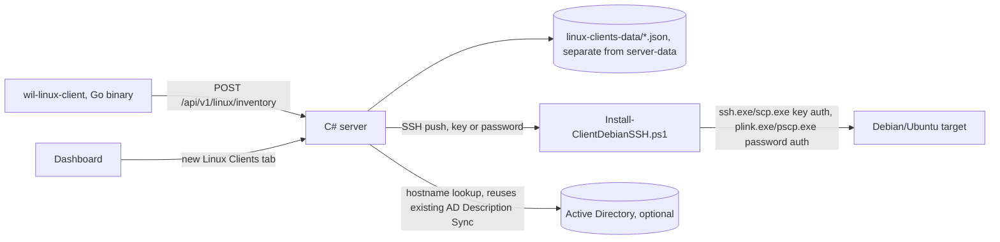

# Linux Client (Debian/Ubuntu) v1 — Design

**Status:** Approved for planning (2026-07-22)
**Branch:** `linux-client`

## Problem

windows-inventory-lite currently only inventories Windows machines. The user's fleet includes Debian-family Linux machines (Debian/Ubuntu) with no coverage at all. This spec covers the first version of a Linux client: a lightweight inventory collector for Debian-family systems, a way to push-install it remotely over SSH, and a place on the dashboard to see what it reports.

Scope is deliberately narrow for v1: get a working, minimal collector reporting real data end to end, with a working remote-install story - not feature parity with the Windows client (no auto-update, no AD-identity-driven credential reuse, no GPO-equivalent deployment).

## Goals

- A single-binary Debian/Ubuntu inventory collector with no runtime dependency on the target machine (mirrors the Windows client's own "no NuGet, no extra runtime" philosophy).
- Reports on a fixed schedule via systemd, not a long-running daemon.
- An admin can push-install it onto one or more target machines from the dashboard over SSH, authenticating with either a key or a password.
- A dedicated dashboard tab shows the reporting Linux fleet, kept visually and structurally separate from the existing Windows-only Clients table (which has fields - Windows/Office activation - that don't apply to Linux at all).
- The Description field behaves exactly like it already does for Windows clients: auto-filled from Active Directory when the host is AD-joined and AD Description Sync is on, manually editable otherwise.

## Non-Goals (deferred, not designed here)

- Client auto-update (Windows' "Client updates" tab has no Linux equivalent yet).
- Any AD-identity-driven credential story for the Linux SSH push (Windows' "Use global AD settings" checkbox has no Linux equivalent - SSH credentials are typed/saved independently).
- Full hardware detail columns in the Linux Clients tab (CPU/RAM/disks are collected and stored, but not rendered as table columns in v1 - available for a later expand-details view without touching the client).
- Non-Debian-family Linux (RHEL/SUSE/Arch/etc.) and non-amd64 architectures (arm64 etc.) - v1 targets Debian/Ubuntu on amd64 only.
- A GPO-equivalent unattended deployment mechanism for Linux (cloud-init, Ansible, etc.) - SSH push is the only install path in v1.

## Architecture



The Linux side is architecturally independent end to end: its own ingestion endpoint, its own storage directory, its own dashboard tab, its own JSON schema (not required to mirror the Windows client's report shape at all). The only piece of existing infrastructure it reuses is AD Description Sync's resolution logic, applied to Linux hostnames the same way it's already applied to Windows ones. This independence is deliberate - the user expects more Linux-specific client capability later, and a shared endpoint/schema would couple that future work to Windows-tested code paths for no benefit.

## Component 1: The Client (`wil-linux-client`)

**Language/build:** Go, compiled to a static binary for `linux/amd64` (`CGO_ENABLED=0` so it has zero shared-library dependencies on the target - not even glibc). One source tree, one build script (`src/Build-LinuxClient.ps1` or a `Makefile`, whichever fits the target build machine - decided in the plan). Version baked in at build time via `-ldflags "-X main.version=..."`, matching how the Windows client's own version constant works, but as its own independent version line (this client has no shared version history with the Windows client's `0.2.0` line - it starts fresh at `0.1.0`).

**Collection, all from `/proc`, `/sys`, and `/etc` - no shelling out to external commands** (mirrors the Windows client's WMI-based collection: read structured OS-provided data directly, don't depend on a CLI tool being present/callable):
- Hostname: `os.Hostname()`.
- OS: parse `/etc/os-release` (`ID`, `VERSION_ID`, `PRETTY_NAME`).
- CPU: parse `/proc/cpuinfo` for the model name line; core count from `runtime.NumCPU()`.
- RAM: parse `/proc/meminfo`'s `MemTotal` line.
- Disks: enumerate `/sys/block/*`, read `size` (512-byte sectors → GB), `queue/rotational` (`0` = SSD, `1` = HDD), `device/model`.
- IP addresses: Go's `net.Interfaces()`/`net.InterfaceAddrs()`, skipping loopback.
- Installed packages: parse `/var/lib/dpkg/status` directly (stanzas separated by blank lines, `Package:`/`Version:` fields) - not `dpkg -l`, so it works even if `dpkg`/`apt` are mid-lock or otherwise unavailable to shell out to.

**Reporting:** one-shot collect-and-POST, then exit - no internal timer/loop (unlike the Windows client, which is a long-running service with its own interval timer). Scheduling is systemd's job: a `.timer` unit fires a `oneshot` `.service` unit on the configured interval. This is the Linux-idiomatic equivalent and keeps the binary itself simple (collect once, report once, exit 0/1).

**Configuration:** command-line flags, passed via the systemd service unit's `ExecStart=`, mirroring how the Windows client takes `--server-url`/`--token`/etc. as arguments rather than a config file:
```
wil-linux-client --server-url <url> [--token <token>]
```

**Report body (independent JSON schema, not shared with the Windows client):**
```json
{
  "hostname": "string",
  "clientVersion": "string",
  "os": { "id": "string", "versionId": "string", "prettyName": "string" },
  "cpu": { "model": "string", "cores": 0 },
  "ramTotalMb": 0,
  "disks": [ { "type": "SSD|HDD", "sizeGb": 0, "model": "string" } ],
  "ipAddresses": ["string"],
  "packages": [ { "name": "string", "version": "string" } ],
  "collectedAt": "RFC3339 timestamp"
}
```

## Component 2: The Server API (`/api/v1/linux/*`)

A fully separate route family in the same C# server process (same executable, same port/listener - just a distinct set of route handlers and its own storage directory), matching the existing `/api/v1/ad/*` sub-namespace precedent already in this codebase:

| Method | Path | Purpose |
|---|---|---|
| POST | `/api/v1/linux/inventory` | Ingest a client report. Gated by the same optional ingestion `Token` the Windows path already uses (shared setting, not duplicated). |
| GET | `/api/v1/linux/clients` | List for the Linux Clients dashboard tab. |
| DELETE | `/api/v1/linux/clients/{hostname}` | Remove a client's stored report. |
| PUT | `/api/v1/linux/clients/{hostname}/description` | Manual description edit (only while AD Description Sync is off for this record - same rule as the Windows path). |

**Storage:** one JSON file per host under a new `linux-clients-data` directory (sibling to `server-data`, configurable the same way via a server option, defaulting under `%ProgramData%\WindowsInventoryLite\linux-clients-data`). Completely separate from the Windows report files - no shared index, no shared read/write lock.

**Description/AD integration:** the exact same `ComputeAdSyncFields`-style resolution the Windows path already has, applied to the Linux hostname instead of the Windows computer name - if `AdDescriptionSyncEnabled` is on and the hostname resolves in AD, the description comes from there (read-only in the UI); otherwise it's the value last set through `PUT .../description` (or blank). This reuses the existing `AdLookupService`/`LdapFilterEscaper` machinery directly - no new AD code, just a second call site.

## Component 3: The Dashboard - "Linux Clients" Tab

A new top-level nav entry (own icon, own view), not a sub-tab of the existing Clients view - the two have almost no schema overlap (no Office/activation concept on Linux at all) and forcing them into one table would mean every Linux row shows meaningless dashes for half the Windows-specific columns.

**Columns:** Computer (hostname), Client version, OS (`prettyName`), IP, Software (package count), Description, Collected. CPU/RAM/disk are collected and stored (see Component 1/2) but not rendered as columns in v1 - this is a pure dashboard-layer decision, revisitable later without touching the client or the API.

**Description column** behaves identically to the Windows Clients table's own Description column: read-only "AD Description" when sync is on for that record, an inline-editable `<input>` when it's off (same save-on-blur/Enter, Escape-to-revert UX already built for Windows - this reuses the existing frontend pattern, not a new one).

## Component 4: Remote Install over SSH (`Install-ClientDebianSSH.ps1`)

Runs on the server (Windows), mirrors `Install-ClientWinRM.ps1`'s shape and parameter naming where it makes sense, but talks SSH instead of WinRM:

```
Install-ClientDebianSSH.ps1
  -ComputerName <string[]>       # target hostnames or IPs, mandatory
  -ServerUrl <string>            # mandatory
  -Token <string>                # optional
  -IntervalHours <int>           # maps to the generated systemd timer's OnUnitActiveSec= (matches this project's existing IntervalHours convention on every other install script)
  -InstallPath <string>          # default /opt/windows-inventory-lite
  -CredentialUsername <string>
  -CredentialPassword <SecureString>   # password auth - routed through plink.exe/pscp.exe
  -KeyPath <string>              # key auth - routed through ssh.exe/scp.exe (Windows' built-in OpenSSH client)
```

**Two auth paths, since Windows' built-in OpenSSH client cannot do unattended password authentication at all** (it refuses to read a password from a non-interactive/piped stdin - by design, no way around it without a different tool):
- **Key auth** → `ssh.exe`/`scp.exe` (built into Windows 10/Server 2019+, zero new dependency).
- **Password auth** → `plink.exe`/`pscp.exe` (PuTTY's command-line tools, MIT-licensed, redistributable) - the one new bundled dependency this feature introduces, needed specifically because there is no dependency-free way to script password-based SSH from Windows. Bundled under `deploy/linux-client/plink.exe`/`pscp.exe`, matching the existing `deploy/client/` convention for Windows GPO deployment assets. A `NOTICE` file records the upstream project/license per this project's attribution rules.

**Install steps, run per target:**
1. Copy `wil-linux-client` (the compiled binary) and generated `.service`/`.timer` unit files to the target via `scp.exe`/`pscp.exe`.
2. Over the same connection type, run remote commands to: move the files into `InstallPath`, install the systemd units into `/etc/systemd/system/`, `systemctl daemon-reload`, `systemctl enable --now wil-linux-client.timer`.
3. Report success/failure per target the same way `Install-ClientWinRM.ps1` already does (one line per host, non-fatal per-host failures don't abort the batch).

**sudo:** the test fleet's `root` user needs no `sudo` at all (already root), but the script should not assume root - if the connecting user isn't root, prefix the remote install commands with `sudo` and surface a clear failure message if `sudo` isn't available/passwordless for that account, rather than a bare permission-denied. (Exact behavior here may need adjusting once the user's own live test-machine survey - which machines have `sudo`, which don't - comes back; noted as a real unknown to verify during implementation, not guessed at now.)

## Testing

- **Client (Go):** unit tests for each parser (`/etc/os-release`, `/proc/cpuinfo`, `/proc/meminfo`, `/sys/block/*`, `/var/lib/dpkg/status`) against fixture files, not the real `/proc`/`/sys` (keeps tests hermetic and runnable on any machine, including this Windows dev box via `go test` if a Go toolchain is available, or deferred entirely to the Linux test fleet if not - decided in the plan).
- **Server (C#):** self-tests for the new pure functions (report parsing/validation, the Linux-specific `ComputeAdSyncFields`-equivalent call), following this project's existing `--self-test` convention.
- **SSH install script:** same standing constraint as every other install/uninstall script in this project - never run for real on the dev machine. Pure logic (auth-path selection, command construction) unit-tested via Pester dot-sourcing, exactly like `Deploy-ClientGpo.ps1`/`Install-Client.ps1` already are.
- **Live verification:** the user has a real Debian test fleet (IP range and credentials shared out-of-band, deliberately never written into any repo file or persisted to long-term memory) with a mix of key/password access and `sudo`/no-`sudo` accounts. Once the client and install script exist, live-test against this fleet and record per-machine behavior (key works? password works? sudo needed/available?) in a local file kept outside git - this survey is real, useful operational data but not appropriate for version control.

## Version

New, independent version line for the Linux client (`0.1.0`, its own line - same reasoning as the Windows client's own decoupled version: this component's version should only move when the Linux client's own code/data changes). Server/dashboard version bumps normally (MINOR, since this adds new endpoints/a new tab) once the server-side pieces ship.
